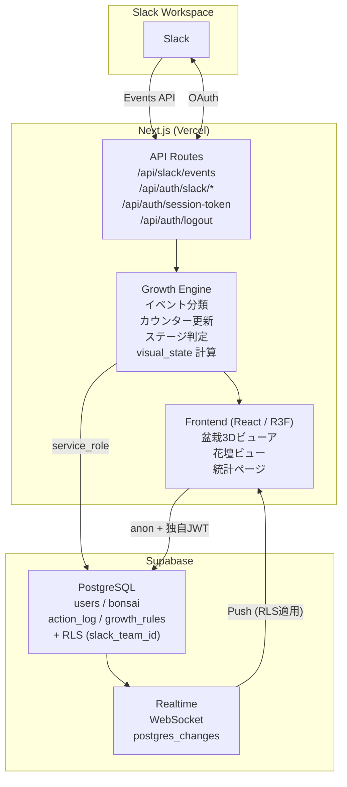
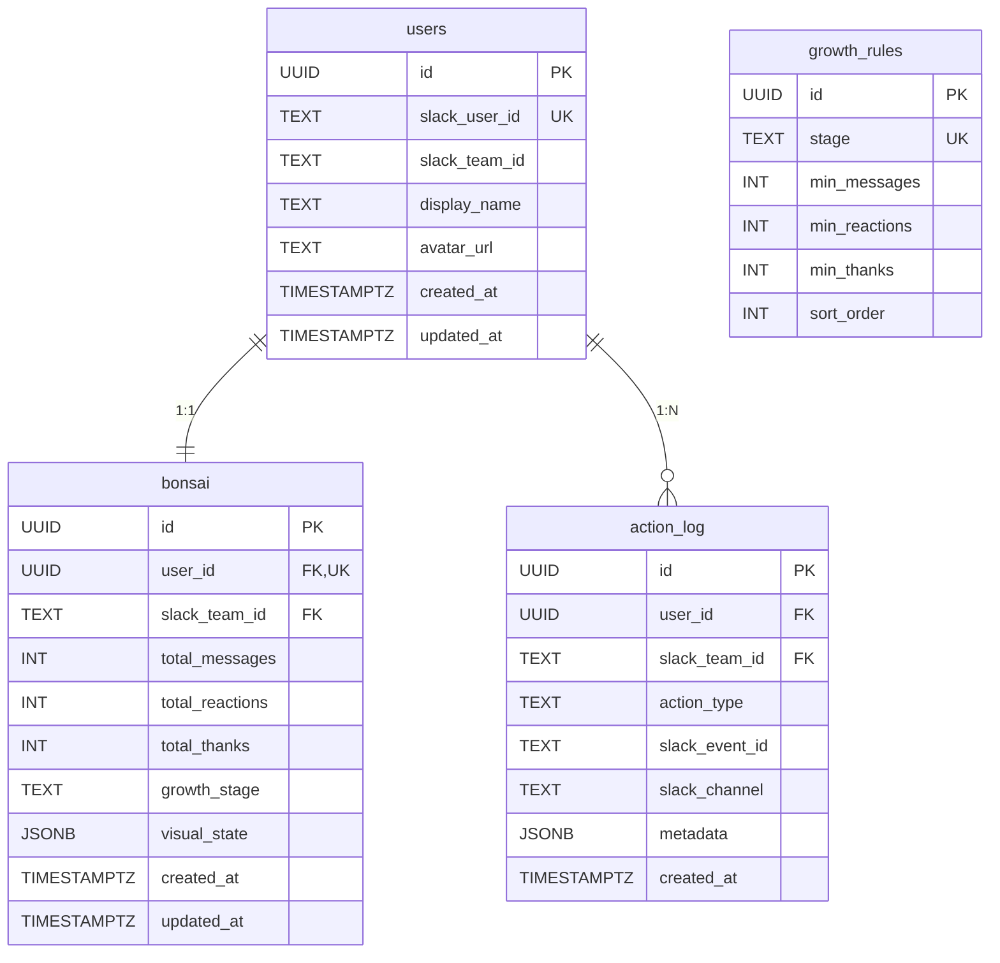
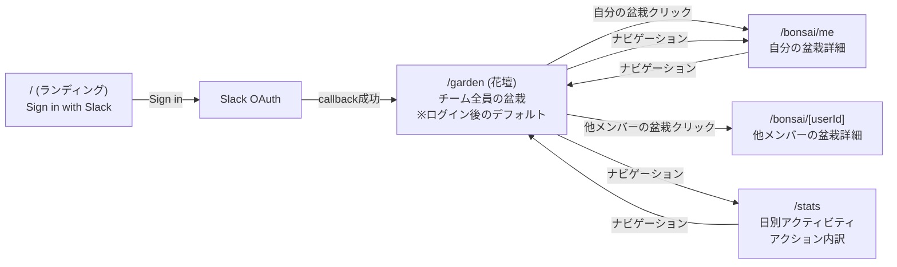

# たま森 (Tamamori)

Slack連携の盆栽育成Webアプリ。チームのSlack活動（メッセージ投稿・リアクション・感謝メッセージ）に応じて、各メンバーの仮想盆栽が8段階で成長します。

## 開発背景

リモートワーク中心のチームでは、日々のコミュニケーションが画面上のログとして流れていき、お互いの貢献や感謝が見えにくくなりがちです。「ありがとう」と書き込む瞬間や、誰かのメッセージにリアクションを返す行為そのものに、もう少し可視化されたフィードバックがあってもいいのではないか — そんな思いから「たま森」は生まれました。

Slackでの活動を「盆栽の成長」というメタファーに置き換え、ただの数値ではなくゆっくりと育っていく姿として表現することで、コミュニケーションそのものを楽しむ余地をつくることを目指しています。盆栽は枯れないので、活動量で他人と競うのではなく、自分のペースで育てる体験になっています。

## 主要な機能

- **Slackイベント連携**: Slack Events API でメッセージ投稿・リアクション追加をリアルタイム受信。本文中の「ありがとう／ありがと／アリガトウ／感謝」を検知して感謝アクションとしても記録します。
- **8段階の成長システム**: `seed → sprout → young → branching → leafy → budding → flowering → full_bloom` の8ステージ。メッセージ・リアクション・感謝の3軸すべての累計でステージが決まる、バランス重視の成長ルール。閾値は `growth_rules` テーブルで管理しデプロイなしで調整可能です。
- **3D盆栽ビュー**: React Three Fiber によるプロシージャル生成。`userId` から決定論的に枝を生成するため、同じユーザーの盆栽は常に同じ形状になります。成長変化は lerp によるなめらかなアニメーション、ステージ昇格時はパーティクルエフェクトで祝福します。
- **マイ盆栽 / 花壇（ガーデン）ビュー**: 自分の盆栽の詳細表示と、チーム全員の盆栽を並べた一覧表示。花壇上の盆栽をクリックすると個別ページに遷移できます。
- **統計ページ**: 日別アクティビティ推移と、アクション種別の内訳を recharts で可視化します。
- **リアルタイム更新**: Supabase Realtime の `postgres_changes` を購読し、Slackでアクションが発生したら、開いている画面上の盆栽がそのまま更新されます。
- **Slack OAuth 認証**: iron-session による暗号化Cookieでセッションを保持。未認証時はランディングページのみアクセス可能です。
- **マルチテナント分離**: iron-session を Root of Trust とした独自JWT発行 + Supabase RLS により、`slack_team_id` 単位でテナント分離。詳細は [ADR-004](docs/adr/004-custom-jwt-for-rls.md) を参照。

## 使用技術

| カテゴリ             | 技術                                                        |
| -------------------- | ----------------------------------------------------------- |
| フレームワーク       | Next.js 16 (App Router)                                     |
| 言語                 | TypeScript                                                  |
| 3D描画               | Three.js / React Three Fiber / drei                         |
| UIスタイリング       | Tailwind CSS v4                                             |
| データ取得           | SWR ([ADR-001](docs/adr/001-swr-adoption.md))               |
| バリデーション       | Zod ([ADR-002](docs/adr/002-zod-adoption.md))               |
| 認証                 | Slack OAuth + iron-session                                  |
| RLS用JWT             | jose (HS256, [ADR-004](docs/adr/004-custom-jwt-for-rls.md)) |
| グラフ描画           | Recharts                                                    |
| データベース         | Supabase (PostgreSQL)                                       |
| リアルタイム         | Supabase Realtime (postgres_changes)                        |
| 単体テスト           | Jest                                                        |
| コンポーネントテスト | Storybook + React Testing Library + Vitest                  |
| E2Eテスト            | Playwright                                                  |
| Lint / Format        | ESLint + eslint-plugin-fsd-lint / Prettier                  |
| CI                   | GitHub Actions                                              |
| ホスティング         | Vercel                                                      |

アーキテクチャは Feature-Sliced Design (FSD) を採用。`app → widgets → features → entities → shared` の単方向依存を `eslint-plugin-fsd-lint` で強制しています。

## インフラ構成図

## ER図

## 画面遷移図

## こだわった実装

### 1. 「3秒ルール」を守りつつ重い処理は非同期で

Slack Events API は3秒以内のレスポンスが必須です。`POST /api/slack/events` は署名検証後に即座に200を返し、Vercel の `waitUntil()` でDB処理（冪等性チェック → カウンター更新 → ステージ判定 → `visual_state` 再計算 → UPDATE）をレスポンス後に走らせる構成にしました。Slackへの応答性能を犠牲にせず、フロントへは Supabase Realtime 経由で確実にPushされます。

### 2. 「同じユーザーの盆栽は常に同じ形」を保証する決定論的プロシージャル生成

盆栽の枝の角度・長さ・分岐シードは `hash(userId + branchIndex)` から決定論的に生成しています。これにより、

- 枝が増えても既存の枝の位置は動かない（成長が「形が変わる」ではなく「枝が増える」体験になる）
- 異なる端末で見ても同じ盆栽が同じ姿で描画される
- glTFアセットを用意せずに「全員ユニーク」を実現できる

を同時に成立させました。`visual_state` の計算はサーバー側で行いDBに保存しているため、全クライアントで完全に一致した描画を保証しています。

### 3. Supabase Realtime + RLS を「ブラウザに service_role を出さずに」両立させる

Realtime の `postgres_changes` は通常の REST と異なり、RLS の評価条件がかなり厳しい（JOIN/EXISTS を使うポリシーは効かない、`REPLICA IDENTITY` を `FULL` にしないと WAL に判定列が乗らない、`accessToken` の auto-setAuth は race する 等）特性があります。

これに対応するため、`iron-session` を Root of Trust として `/api/auth/session-token` で独自JWT (HS256, `slack_team_id` claim) を都度発行し、Realtime hook 側で **subscribe 前に `await supabase.realtime.setAuth(token)`** を明示的に呼ぶ構成を採用しました。RLSポリシーは `bonsai.slack_team_id` を直接参照する単純な形に揃え、`REPLICA IDENTITY FULL` で WAL に列を含めることでテナント漏れを物理的に防いでいます。設計判断の経緯は [ADR-004](docs/adr/004-custom-jwt-for-rls.md) にまとめています。

### 4. FSD アーキテクチャを ESLint で強制

`app / widgets / features / entities / shared` の5層構造で、上位層は下位層しかインポートできず、同一層内の他スライスへの直接インポートは禁止というルールを `eslint-plugin-fsd-lint` で機械的に強制しています。各スライスは必ず `index.ts` を Public API として通すため、内部実装の変更が他スライスに漏れにくく、リファクタしやすい構造を維持しています。

### 5. TDD と Storybook 駆動のコンポーネント開発

ロジックは Jest による Red-Green-Refactor、UI コンポーネントは Storybook + Vitest + React Testing Library での Story 駆動 TDD という二段構えで開発しています。`visual_state` の計算式やステージ判定など、外部システムに依存しない純粋ロジックは特に手厚くテストし、Supabase や Slack といった境界はZodで検証してから内側に渡す設計です。

## 今後の開発について

現バージョンの開発を通じて、Next.js の API Route にドメインロジックが集中し、事実上の BFF (Backend for Frontend) として肥大化していること、3D表現の自由度や保守性に課題が残ることが見えてきました。次フェーズでは、これらの学びを踏まえたアーキテクチャの抜本的な見直しを進めます。

- **責務分離の見直し**: ドメインロジックを API Route から切り離し、独立したサーバー層として再設計
- **技術スタックの再選定**: 上記方針に合わせてフレームワーク・データ層を再評価
- **データモデル / API 設計の見直し**: テナント分離・冪等性の責務を再整理
- **3D表現の再検討**: プロシージャル生成 / glTF アセットを含めたアプローチを再評価

---

詳細な仕様・設計判断は [`docs/`](docs/) 配下のドキュメントを参照してください。

- [要件定義](docs/requirements.md)
- [アーキテクチャ構成](docs/architecture.md)
- [技術スタック](docs/tech-stack.md)
- [API設計](docs/api-design.md)
- [データモデル設計](docs/data-model.md)
- [ディレクトリ構成](docs/directory-structure.md)
- [ADR (Architecture Decision Records)](docs/adr/)
