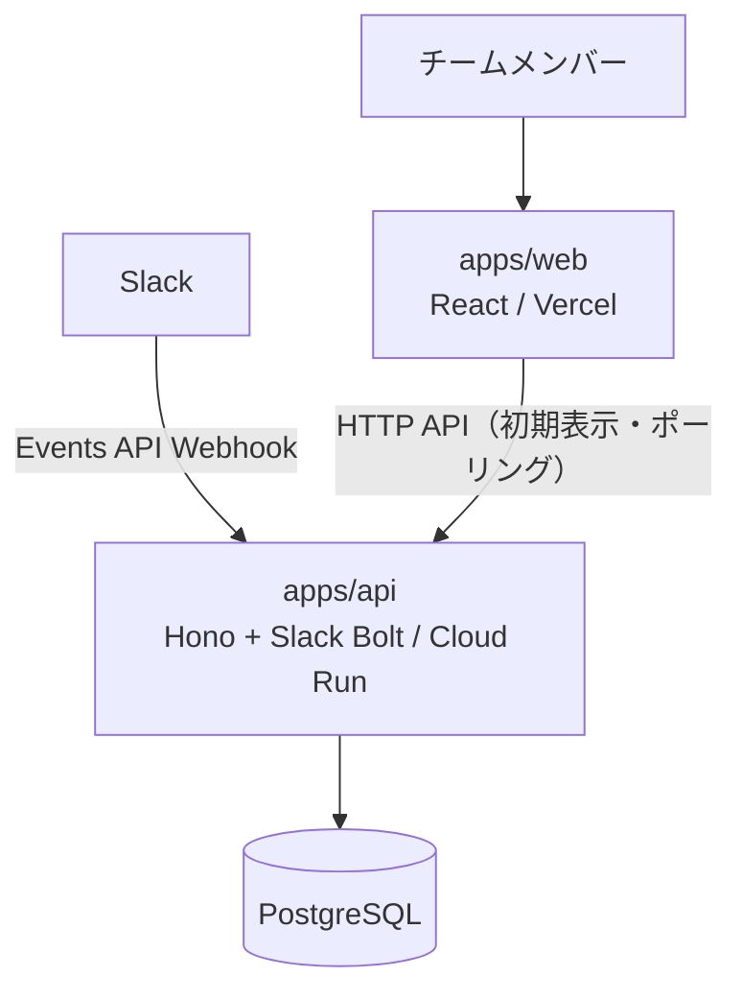

# アーキテクチャ設計

## 1. システム概要

たま森は、チャットツール上の活動を元にユーザーごとの盆栽状態を更新し、フロントエンドへ表示・反映するサービスである。

MVPでは、フロントエンドとバックエンドを分離しつつ、バックエンドは単一のAPIサーバーとして構築する。



### 前提

- 初期対応チャットツールはSlackのみとする。
- フロントエンドとバックエンドは分離して構築する。
- バックエンドはBFFではなく、独立したAPIサーバーとして構築する。
- 投稿本文や会話履歴は保存しない。
- Slackイベントは内部の活動イベントへ変換して扱う。

## 2. 技術スタック

本節は**目標構成（北極星）の技術を正**として記述する。実コードは現状 `src/` 配下の Next.js 16 + Supabase 構成であり、そこから本節のスタックへ移行中である。現状との差分は各項の「移行メモ」で補足する。バージョンはメジャーを明記する。

ツールチェーンは VoidZero の統合ツールチェーン **Vite+（CLI: `vp`）** に統一する。Vite+ は Vite / Vitest / Oxlint / Oxfmt / Rolldown / tsdown を 1 つに束ね、`vite.config.ts` 単一で構成し、パッケージマネージャ（pnpm）をラップして動作する。詳細は §2.5。

### 2.1 共通基盤

- **TypeScript 5** — apps/web・apps/api 双方の実装言語。
- **pnpm workspaces** — モノレポ管理。`apps/*` を workspace として扱う。（移行メモ: 現状は npm）
- **zod 4** — 入出力・内部活動イベントのスキーマ検証。web / api 双方で利用する。

### 2.2 apps/web（フロントエンド）

画面表示に専念する。初期表示・状態更新ともに HTTP API で取得する（更新はポーリング）。

- **Vite+（`vp`）+ React 19** — SPA として構築する。dev/build/check/test は `vp` に集約する。（移行メモ: 現状は Next.js 16。表示専念の SPA へ移行する）
- **Tailwind CSS v4** — スタイリング。
- **Three.js + @react-three/fiber + @react-three/drei** — 盆栽の 3D 描画。表現方針（成長段階・季節・活力・個体差）は [visual-design.md](visual-design.md) を参照。
- **SWR** — HTTP API からの初期状態取得とキャッシュ。
- **ポーリング（SWR `refreshInterval`）** — 盆栽状態更新を一定間隔で再取得して反映する（目安 30〜60 秒）。更新反映の方式は [ADR-004](adr/004-update-delivery-polling.md) を参照。
- **lucide-react** — アイコン。
- デプロイ先は **Vercel**（静的配信）。詳細は §5・requirements.md を参照。

### 2.3 apps/api（バックエンド）

HTTP API・Slack Webhook 受信・活動イベント変換・盆栽状態計算を担う。DB へアクセスするのは apps/api のみとする。更新の反映は apps/web 側のポーリングで行うため、push 配信（WebSocket）は持たず stateless な HTTP API に保つ。

- **Hono** — HTTP API フレームワーク。
- **Slack Bolt** — Slack Events API の受信・署名検証・イベントハンドリング。
- **更新の反映** — apps/web のポーリングで行う。apps/api は push 配信を持たないため、複数インスタンス間の fan-out は不要（[ADR-004](adr/004-update-delivery-polling.md)）。
- **Drizzle ORM** — PostgreSQL へのアクセス層。スキーマ定義・型生成・マイグレーションを担う。採用判断は [ADR-002](adr/002-drizzle-orm-adoption.md) を参照。（移行メモ: 現状は Supabase client）
- **zod 4** — リクエスト・イベントの検証。
- **認証 / セッション** — Slack OAuth でログインし、**iron-session**（Cookie セッション）＋ **jose**（JWT）でセッションを扱う。
- デプロイ先は **Cloud Run**（コンテナ）。詳細は §5・requirements.md を参照。

### 2.4 データストア

- **PostgreSQL** を採用する。apps/api のみがアクセスする。apps/web は DB へ直接アクセスしない。
- ホスティングは **Cloud SQL for PostgreSQL**（apps/api と同一 GCP・同一リージョン、Cloud SQL Connector + IAM 認証）。**ローカル開発は Docker の素の PostgreSQL** を用い、drizzle-kit の同一マイグレーションでスキーマ整合を保つ。採用判断は [ADR-003](adr/003-cloud-sql-hosting.md) を参照。
- マイグレーションは Drizzle で管理する。
- スキーマ詳細は database-design.md、採用判断は [ADR-001](adr/001-postgresql-adoption.md)・[ADR-002](adr/002-drizzle-orm-adoption.md)・[ADR-003](adr/003-cloud-sql-hosting.md) を参照。

### 2.5 開発ツール・品質

apps/web のツールチェーンは **Vite+（CLI: `vp`）** に一本化する。Vite+ は Vite / Vitest / Oxlint / Oxfmt / Rolldown / tsdown を 1 つに束ね、`vite.config.ts` 単一で構成し、pnpm をラップして動作する（本記述時点では alpha、npm パッケージ `vite-plus`。バージョンはピン留めする）。

- **ビルド / Dev** — apps/web は `vp dev` / `vp build`（内部は Vite + Rolldown）。apps/api は Vite+ の対象外（フロントエンド専用）のため、`tsx` で起動し **tsdown**（Rolldown ベース）でバンドルする。
- **Lint・フォーマット・型チェック** — apps/web は `vp check`（**Oxlint + Oxfmt + 型チェック**を一括）。ただし **FSD レイヤー境界は Oxlint で表現できないため、ESLint + eslint-plugin-fsd-lint を併走**させるハイブリッドとする（`vp` のカスタムタスク等で連結。`src/` → apps/web 移行＝#93 以降で適用）。
- **単体テスト** — apps/web は `vp test`（**Vitest**）。
- **E2E テスト** — **Playwright**。
- **UI カタログ** — **Storybook**。
- **移行中の root（`src/` の Next.js）** — 移行完了まで現行の **ESLint + Prettier + Jest** で統治する。Vite+ への一本化は段階的に行う。

### 2.6 インフラ・デプロイ・CI/CD

- **apps/web** — Vercel。
- **apps/api** — Cloud Run（コンテナ）。
- **データベース** — Cloud SQL for PostgreSQL（apps/api と同一 GCP・同一リージョン）。ローカル開発は Docker PostgreSQL。詳細は [ADR-003](adr/003-cloud-sql-hosting.md)。
- **CI/CD** — GitHub Actions。（移行メモ: 現在一旦廃止しており、再整備を予定）
- 秘密情報は環境変数で管理する。

## 3. 主要ディレクトリ構成

```text
apps/
    web/
    api/

docs/
    requirements.md
    architecture-design.md
    api-design.md
    database-design.md
    visual-design.md
    adr/
```

### apps/web

- 自分の盆栽画面を表示する。
- チームの盆栽一覧画面を表示する。
- 初期表示時はHTTP APIで盆栽状態を取得する。
- 盆栽状態の更新はポーリングで定期取得して反映する。

### apps/api

- HTTP APIを提供する。
- Slack Events APIのWebhookを受信する。
- Slackイベントを内部の活動イベントへ変換する。
- 活動ログを保存する。
- 盆栽状態を計算・保存する。

## 4. 主要データフロー

### 初期表示

1. ユーザーがapps/webを開く。
2. apps/webがapps/apiのHTTP APIから現在の盆栽状態を取得する。
3. apps/webが自分の盆栽画面またはチームの盆栽一覧画面を表示する。

### Slackイベント処理

1. Slack Events APIからapps/apiへイベントが送信される。
2. apps/apiでSlackリクエストの署名を検証する。
3. Slackイベントを内部の活動イベントへ変換する。
4. 活動イベントを活動ログとして保存する。
5. 活動ログを元に、盆栽状態を計算して保存する。（apps/api は push 配信を行わない。更新は apps/web の次回ポーリングで反映される）

### 更新の反映（ポーリング）

1. apps/webが一定間隔（SWR `refreshInterval`、目安 30〜60 秒）でapps/apiのHTTP APIから最新の盆栽状態を取得する。
2. 取得した最新状態で画面上の盆栽状態を更新する。
3. 一時的な取得失敗は次回のポーリングで回復する（持続接続を持たないため再接続処理は不要）。

更新反映の方式は [ADR-004](adr/004-update-delivery-polling.md) を参照。

## 5. 設計判断・関連ADR

### フロントエンドとバックエンドを分離する

- apps/webとapps/apiは分離して構築する。
- apps/webは画面表示に集中する。
- apps/apiはHTTP API、Slack Webhook受信、盆栽状態更新を担当する（更新の反映は apps/web のポーリング）。

### バックエンドはBFFではなく独立したAPIサーバーとする

- apps/apiは単なるフロントエンド向けの中継層にはしない。
- Slackイベント処理、活動ログ記録、盆栽状態計算をバックエンドの責務として扱う。

### Slackイベントは内部活動イベントへ変換する

- Slack固有のイベント形式を、そのままアプリケーション全体で扱わない。
- Slackイベントは、サービス内部で扱う活動イベントへ変換してから保存・更新処理に渡す。
- 将来的に他のチャットツールへ拡張できるようにする。

### apps/apiはCloud Runにデプロイする

- Hono + Slack Boltを用いたバックエンドコンテナとして管理する。
- HTTP API、Slack Events APIを1つのNode.jsバックエンドで扱う。
- Webhook受信時の速やかな応答を考慮する。更新の反映は apps/web のポーリングで行うため、push 配信は持たず stateless に保つ（複数インスタンス間の状態同期・fan-out は不要）。

### 将来の切り出し方針

MVPではapps/apiがHTTP API、Slack Webhook受信、盆栽状態更新を担当する。

将来的にチャットツール連携やイベント処理が複雑になった場合、以下の責務を別パッケージまたは別アプリとして切り出す。

- Webhook受信
- イベント変換
- 盆栽状態計算

### 関連ADR

- [ADR-001: PostgreSQLを採用する](adr/001-postgresql-adoption.md)
- [ADR-002: DBアクセス層にDrizzle ORMを採用する](adr/002-drizzle-orm-adoption.md)
- [ADR-003: PostgreSQL のホスティングに Cloud SQL を採用する](adr/003-cloud-sql-hosting.md)
- [ADR-004: 盆栽状態の更新反映にポーリングを採用する](adr/004-update-delivery-polling.md)
