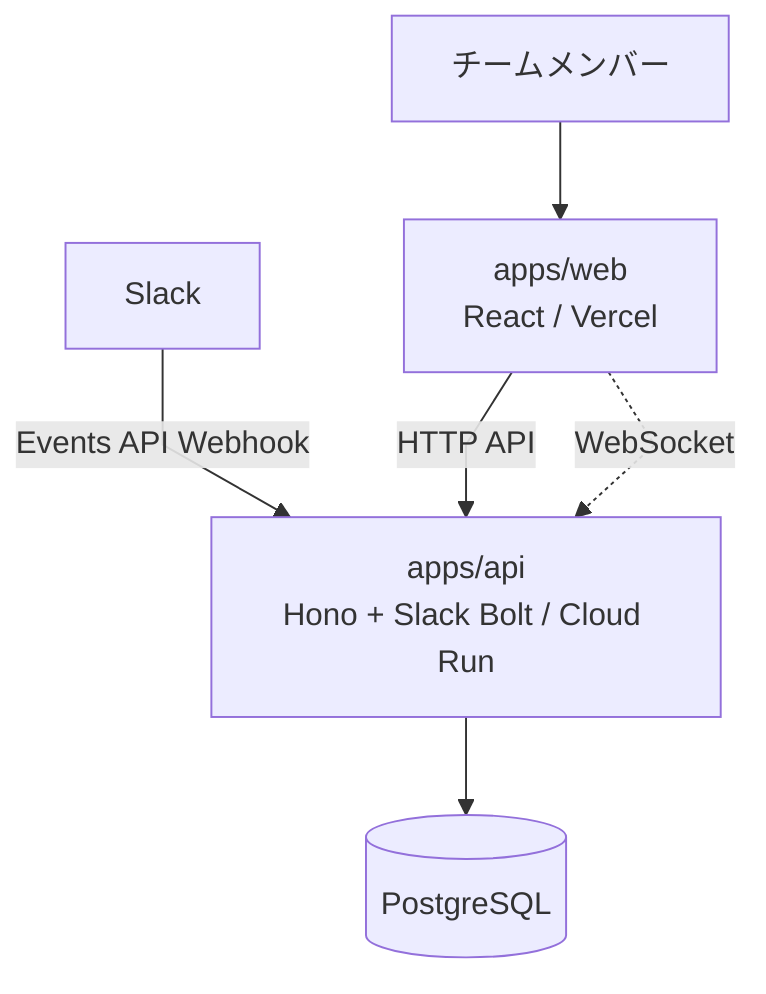

# アーキテクチャ設計

## 1. システム概要

たま森は、チャットツール上の活動を元にユーザーごとの盆栽状態を更新し、フロントエンドへ表示・反映するサービスである。

MVPでは、フロントエンドとバックエンドを分離しつつ、バックエンドは単一のAPIサーバーとして構築する。



### 前提

- 初期対応チャットツールはSlackのみとする。
- フロントエンドとバックエンドは分離して構築する。
- バックエンドはBFFではなく、独立したAPIサーバーとして構築する。
- 投稿本文や会話履歴は保存しない。
- Slackイベントは内部の活動イベントへ変換して扱う。

## 2. 技術スタック

本節は**目標構成（北極星）の技術を正**として記述する。実コードは現状 `src/` 配下の Next.js 16 + Supabase 構成であり、そこから本節のスタックへ移行中である。現状との差分は各項の「移行メモ」で補足する。バージョンはメジャーを明記する。

ツールチェーンは Vite を中心とした **VoidZero 系（Vite / Vitest / Oxc / Rolldown）へ統一**する方針とする。

### 2.1 共通基盤

- **TypeScript 5** — apps/web・apps/api 双方の実装言語。
- **pnpm workspaces** — モノレポ管理。`apps/*` を workspace として扱う。（移行メモ: 現状は npm）
- **zod 4** — 入出力・内部活動イベントのスキーマ検証。web / api 双方で利用する。

### 2.2 apps/web（フロントエンド）

画面表示に専念する。初期表示は HTTP API、状態更新は WebSocket で受信する。

- **Vite + React 19** — SPA として構築する。（移行メモ: 現状は Next.js 16。表示専念の SPA へ移行する）
- **Tailwind CSS v4** — スタイリング。
- **Three.js + @react-three/fiber + @react-three/drei** — 盆栽の 3D 描画。
- **SWR** — HTTP API からの初期状態取得とキャッシュ。
- **WebSocket クライアント** — 盆栽状態更新の受信。切断時は再接続する。
- **recharts** — 活動量などの補助的な可視化。
- **lucide-react** — アイコン。
- デプロイ先は **Vercel**（静的配信）。詳細は §5・requirements.md を参照。

### 2.3 apps/api（バックエンド）

HTTP API・Slack Webhook 受信・活動イベント変換・盆栽状態計算・WebSocket 配信を担う。DB へアクセスするのは apps/api のみとする。

- **Hono** — HTTP API フレームワーク。
- **Slack Bolt** — Slack Events API の受信・署名検証・イベントハンドリング。
- **WebSocket 配信** — 盆栽状態更新の配信。複数インスタンス間の配信（fan-out）は将来課題とし、必要になった時点で Pub/Sub を検討する。
- **Drizzle ORM** — PostgreSQL へのアクセス層。スキーマ定義・型生成・マイグレーションを担う。採用判断は [ADR-002](adr/002-drizzle-orm-adoption.md) を参照。（移行メモ: 現状は Supabase client）
- **zod 4** — リクエスト・イベントの検証。
- **認証 / セッション** — Slack OAuth でログインし、**iron-session**（Cookie セッション）＋ **jose**（JWT）でセッションを扱う。
- デプロイ先は **Cloud Run**（コンテナ）。詳細は §5・requirements.md を参照。

### 2.4 データストア

- **PostgreSQL** を採用する。apps/api のみがアクセスする。apps/web は DB へ直接アクセスしない。
- マイグレーションは Drizzle で管理する。
- スキーマ詳細は database-design.md、採用判断は [ADR-001](adr/001-postgresql-adoption.md)・[ADR-002](adr/002-drizzle-orm-adoption.md) を参照。

### 2.5 開発ツール・品質

ツールチェーンは VoidZero 系へ統一する。ただし Lint は FSD 境界強制の都合でハイブリッド構成とする。

- **ビルド / Dev サーバ** — apps/web は **Vite**。apps/api は **tsdown**（Rolldown ベース）でバンドルする。rolldown-vite・oxc-formatter は安定後に採用を検討する。
- **Lint（ハイブリッド）** — **oxlint** を主として高速にチェックする。加えて **ESLint 9 + eslint-plugin-fsd-lint** を FSD レイヤー境界の強制のみに残す。両者は単一の lint スクリプト（`pnpm lint`）で連結して実行する。将来 oxlint 側で FSD 境界を表現できるようになれば ESLint を畳む。
- **フォーマット** — **Prettier**（oxc-formatter は安定後に検討）。
- **単体テスト** — **Vitest**。（移行メモ: 現状は Jest）
- **E2E テスト** — **Playwright**。
- **UI カタログ** — **Storybook**（addon-a11y などを利用）。

### 2.6 インフラ・デプロイ・CI/CD

- **apps/web** — Vercel。
- **apps/api** — Cloud Run（コンテナ）。
- **CI/CD** — GitHub Actions。（移行メモ: 現在一旦廃止しており、再整備を予定）
- 秘密情報は環境変数で管理する。

## 3. 主要ディレクトリ構成

```text
apps/
    web/
    api/

docs/
    requirement.md
    architecture.md
    api.md
    database.md
    adr/
```

### apps/web

- 自分の盆栽画面を表示する。
- チームの盆栽一覧画面を表示する。
- 初期表示時はHTTP APIで盆栽状態を取得する。
- 盆栽状態の更新はWebSocketで受け取る。

### apps/api

- HTTP APIを提供する。
- Slack Events APIのWebhookを受信する。
- Slackイベントを内部の活動イベントへ変換する。
- 活動ログを保存する。
- 盆栽状態を計算・保存する。
- 盆栽状態の更新をWebSocketで配信する。

## 4. 主要データフロー

### 初期表示

1. ユーザーがapps/webを開く。
2. apps/webがapps/apiのHTTP APIから現在の盆栽状態を取得する。
3. apps/webが自分の盆栽画面またはチームの盆栽一覧画面を表示する。

### Slackイベント処理

1. Slack Events APIからapps/apiへイベントが送信される。
2. apps/apiでSlackリクエストの署名を検証する。
3. Slackイベントを内部の活動イベントへ変換する。
4. 活動イベントを活動ログとして保存する。
5. 活動ログを元に、盆栽状態を計算して保存する。
6. 更新された盆栽状態をWebSocketでapps/webへ配信する。

### リアルタイム更新

1. apps/webがapps/apiのWebSocketを購読する。
2. 盆栽状態が更新された場合、apps/apiがWebSocketで更新を配信する。
3. apps/webが画面上の盆栽状態を更新する。
4. WebSocketが切断された場合、apps/webは再接続する。

## 5. 設計判断・関連ADR

### フロントエンドとバックエンドを分離する

- apps/webとapps/apiは分離して構築する。
- apps/webは画面表示に集中する。
- apps/apiはHTTP API、Slack Webhook受信、盆栽状態更新、WebSocket配信を担当する。

### バックエンドはBFFではなく独立したAPIサーバーとする

- apps/apiは単なるフロントエンド向けの中継層にはしない。
- Slackイベント処理、活動ログ記録、盆栽状態計算をバックエンドの責務として扱う。

### Slackイベントは内部活動イベントへ変換する

- Slack固有のイベント形式を、そのままアプリケーション全体で扱わない。
- Slackイベントは、サービス内部で扱う活動イベントへ変換してから保存・更新処理に渡す。
- 将来的に他のチャットツールへ拡張できるようにする。

### apps/apiはCloud Runにデプロイする

- Hono + Slack Boltを用いたバックエンドコンテナとして管理する。
- HTTP API、Slack Events API、WebSocketを1つのNode.jsバックエンドで扱う。
- Webhook受信時の速やかな応答、WebSocketの再接続、複数インスタンス時の状態同期を考慮する。

### 将来の切り出し方針

MVPではapps/apiがHTTP API、Slack Webhook受信、盆栽状態更新、WebSocket配信を担当する。

将来的にチャットツール連携やイベント処理が複雑になった場合、以下の責務を別パッケージまたは別アプリとして切り出す。

- Webhook受信
- イベント変換
- 盆栽状態計算
- WebSocket配信

### 関連ADR

- [ADR-001: PostgreSQLを採用する](adr/001-postgresql-adoption.md)
- [ADR-002: DBアクセス層にDrizzle ORMを採用する](adr/002-drizzle-orm-adoption.md)
