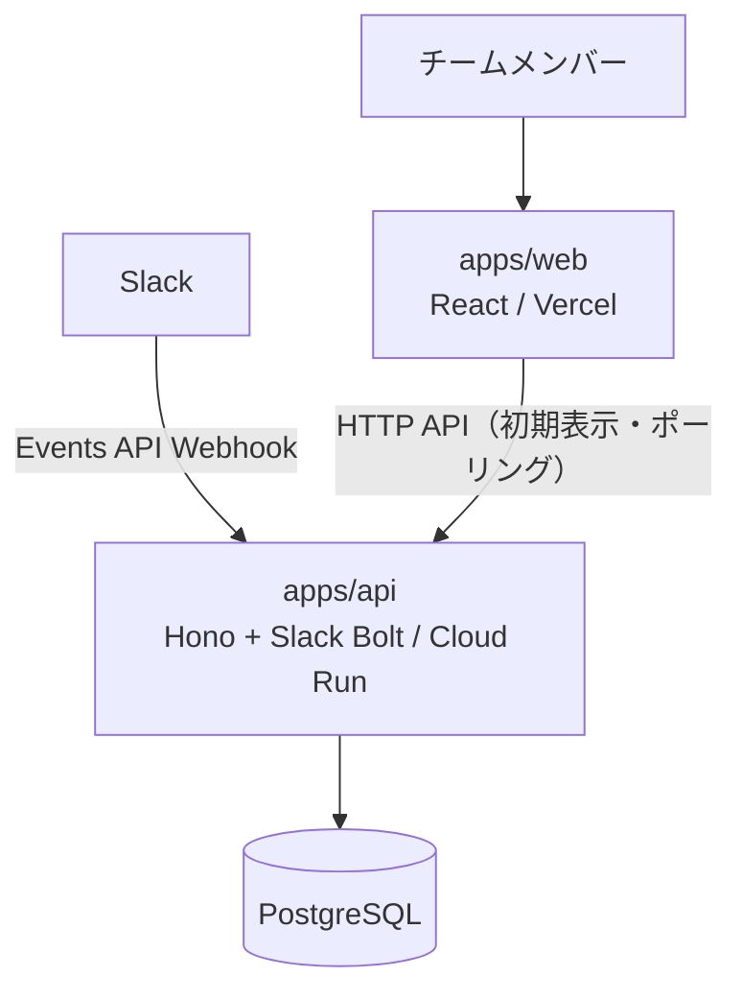
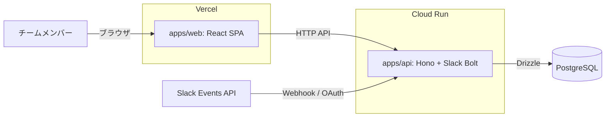
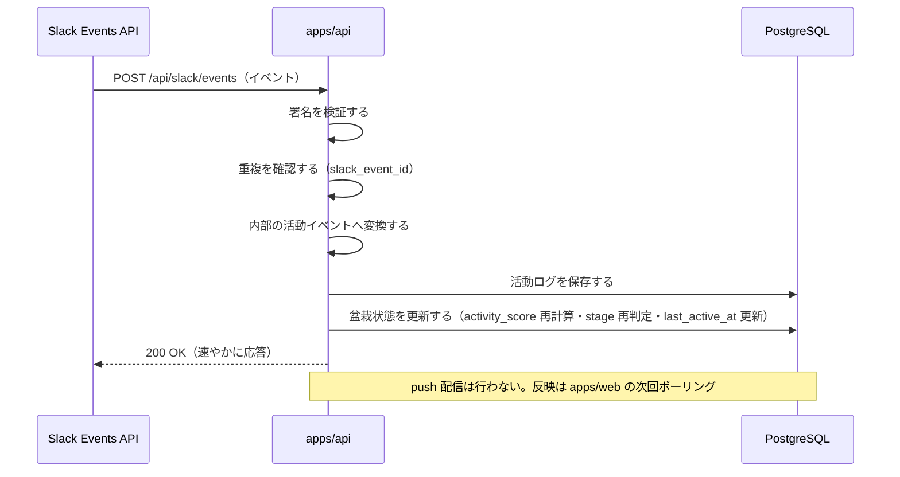
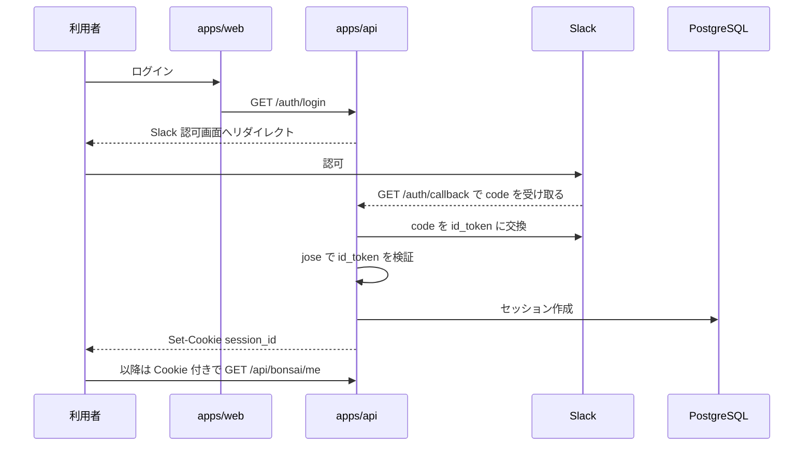

# アーキテクチャ設計

> たま森を「どう作るか」を定義する。Slack 上の活動を盆栽状態へ変換・表示するシステムの構成・技術スタック・データフロー・設計判断をまとめる。満たすべき要件は [requirements.md](requirements.md)、データ構造は [db.md](db.md)、API は [api.md](api.md) を参照。用語は [glossary.md](glossary.md)。

## 1. Goals / Non-Goals

### Goals

- フロントエンド（表示）とバックエンド（処理）を分離し、それぞれ独立してデプロイ・スケールできる構成にする。
- Slack 依存を内部の活動イベントへ隔離し、将来の他チャットツール拡張に備える。
- 盆栽の描画入力（`stage` / `seed` / `vitality` / `season`）をサーバ側で一元的に算出し、フロントは描くだけのビューアに保つ。
- 更新反映を stateless なポーリングで実現し、複数インスタンス運用でも状態同期を不要にする。
- マルチテナント（任意の Slack ワークスペースが導入可能）で、テナント分離と即時失効可能なセッションを持つ。

### Non-Goals

- リアルタイム性の高い push 配信（WebSocket 等）は持たない（[ADR-004](adr/004-update-delivery-polling.md)）。
- バックエンドをフロント専用の中継層（BFF）にはしない。
- Slack 以外のチャットツール連携・投稿内容の高度な解析は MVP では扱わない。

## 2. システムコンテキスト

たま森は、チームメンバーの Slack 上の活動を元に盆栽状態を更新し、フロントエンドへ表示・反映するサービスである。MVP ではフロントエンドとバックエンドを分離しつつ、バックエンドは単一の API サーバーとして構築する。



### 前提

- 初期対応チャットツールは Slack のみとする。
- フロントエンドとバックエンドは分離して構築する。バックエンドは BFF ではなく独立した API サーバーとする。
- 投稿本文や会話履歴は保存しない。
- Slack イベントは内部の活動イベントへ変換して扱う。

## 3. コンテナ構成

デプロイ境界を含めたコンテナ単位の構成は以下。web / api は共通の登録可能ドメイン配下のカスタムドメイン（`app.<domain>` / `api.<domain>`）で公開する（認証の前提。§9・[ADR-009](adr/009-auth-architecture.md)）。



### apps/web の責務

- 自分の盆栽画面・チームの盆栽一覧画面を表示する。
- 初期表示時に HTTP API で盆栽状態を取得する。
- 盆栽状態の更新をポーリングで定期取得して反映する。
- DB へ直接アクセスしない（盆栽状態は apps/api 経由で取得する）。

### apps/api の責務

- HTTP API を提供する。
- Slack Events API の Webhook を受信し、署名を検証する。
- Slack アプリのインストール（OAuth）と利用者ログイン（OIDC）を扱う。
- Slack イベントを内部の活動イベントへ変換する。
- 活動ログを保存し、盆栽状態を計算・保存する。
- DB へアクセスする唯一のコンポーネントである。

## 4. 技術スタック

目標構成（北極星）の技術を正として記述する。バージョンはメジャーを明記する。ツールチェーンは VoidZero の統合ツールチェーン **Vite+（CLI: `vp`）** を中心に据える（Vite / Vitest / Oxlint / Oxfmt / Rolldown / tsdown を 1 つに束ね、`vite.config.ts` 単一で構成し pnpm をラップする）。詳細な運用は §5。

### 4.1 共通基盤

| 技術 | バージョン | 用途 | 関連 |
| --- | --- | --- | --- |
| TypeScript | 5 | apps/web・apps/api の実装言語 | — |
| pnpm workspaces | — | モノレポ管理（`apps/*` を workspace 化） | — |
| mise | — | Node（22 LTS）等のバージョン管理・コマンド窓口の一本化 | [ADR-007](adr/007-mise-toolchain-management.md) |
| zod | 4 | 入出力・内部活動イベントのスキーマ検証 | — |

### 4.2 apps/web（フロントエンド）

| 技術 | バージョン | 用途 | 関連 |
| --- | --- | --- | --- |
| Vite+（`vp`）+ React | React 19 | 表示専念の SPA。dev/build/check/test を `vp` に集約 | — |
| TanStack Router | — | 型安全な SPA ルーティング（2 画面＋直リンク）。loader で TanStack Query と連携 | — |
| TanStack Query（`@tanstack/react-query`） | — | サーバ状態の取得・キャッシュ・**ポーリング（`refetchInterval` 目安 30〜60 秒、非表示時は停止）** | [ADR-004](adr/004-update-delivery-polling.md) |
| Tailwind CSS | v4 | スタイリング（`@theme inline` で design tokens を橋渡し） | [design-tokens.md](design-tokens.md) |
| shadcn/ui | — | Radix UI primitives + Tailwind のコピー&ペースト型 UI（ソース所有、a11y 挙動） | [ADR-012](adr/012-design-system.md) |
| Radix Colors | — | カラー primitive（12段階・light/dark 自動。neutral=sage / primary=jade） | [design-tokens.md](design-tokens.md) |
| tw-animate-css | — | アニメーションユーティリティ（shadcn v4 既定） | — |
| Three.js + @react-three/fiber + @react-three/drei | — | 盆栽の 3D 描画 | [visual.md](visual.md) |
| lucide-react | — | アイコン | — |

- **デザインシステム / アクセシビリティ**: サービス 2D UI のトークン・配色・グリッド・WCAG 2.2 AA 方針は [design-tokens.md](design-tokens.md) を単一の正とする（3D 盆栽の [visual.md](visual.md) とは別レイヤ。[ADR-012](adr/012-design-system.md)）。

### 4.3 apps/api（バックエンド）

| 技術 | バージョン | 用途 | 関連 |
| --- | --- | --- | --- |
| Hono | — | HTTP API フレームワーク | — |
| Slack Bolt | — | Slack Events 受信・署名検証・OAuth インストール・InstallationStore（Hono に custom receiver で統合） | [ADR-010](adr/010-slack-hono-receiver.md) |
| Drizzle ORM | — | PostgreSQL アクセス層（スキーマ定義・型生成・マイグレーション） | [ADR-002](adr/002-drizzle-orm-adoption.md) |
| jose | — | Slack id_token（OIDC）の JWKS 署名検証 | [ADR-009](adr/009-auth-architecture.md) |
| DB セッション | — | 利用者セッション（Postgres `sessions` テーブル＋不透明 session ID Cookie。ステートフル） | [ADR-009](adr/009-auth-architecture.md) |

- **認証 / セッション**: 3 層モデル（マルチテナント install / 署名検証 / Sign in with Slack(OIDC)）。詳細は §9 と [ADR-009](adr/009-auth-architecture.md) / [ADR-010](adr/010-slack-hono-receiver.md)。
- **内部構成（ヘキサゴナル）**: `domain/`（純粋コア: activity 変換・bonsai 計算）＋ `adapters/`（slack / http / db）＋ `auth/` ＋ `contracts/`（zod）＋ `config/` ＋ composition root。DB アクセスは db アダプタのみ（[ADR-008](adr/008-apps-api-hexagonal.md)）。
- **web↔api 型共有**: **Hono RPC（`hc`）** ＋ pnpm project references により、コード生成なしでエンドツーエンドの型安全を得る（`contracts/` の zod を境界の正とする）。

### 4.4 データストア

| 技術 | バージョン | 用途 | 関連 |
| --- | --- | --- | --- |
| PostgreSQL / Cloud SQL | — | 唯一のデータストア。apps/api のみアクセス。ローカルは Docker PostgreSQL | [ADR-001](adr/001-postgresql-adoption.md) / [ADR-003](adr/003-cloud-sql-hosting.md) |

- **スキーマとマイグレーション**: Drizzle で管理し、ローカル / デプロイ環境で同一マイグレーションを適用する。詳細は [db.md](db.md)。
- **コネクションプール**: Cloud Run はインスタンスごとに接続を持つため、**インスタンスあたりの pool `max` を小さく**保ち、Cloud SQL の接続上限を超えないようにする。接続は **Cloud SQL Connector**（IAM 認証）経由。トランザクションプーラ（PgBouncer 等）を挟む場合は prepared statements を無効化する（[ADR-003](adr/003-cloud-sql-hosting.md)）。

## 5. 開発ツール・品質

apps/web は **Vite+（`vp`）** に一本化する。apps/api は Vite+（フロントエンド専用）の対象外のため、同系のツール（oxlint / oxfmt / Vitest）を standalone で採用する。Vite+ は新しいツールのためバージョンをピン留めして使う。

| 目的 | apps/web | apps/api | 備考 |
| --- | --- | --- | --- |
| ランタイム / コマンド | mise（Node 22 LTS） | mise（Node 22 LTS） | `vp env off` で Node 管理を mise へ委譲 |
| ビルド / Dev | `vp dev` / `vp build`（Vite + Rolldown） | `tsx` 起動 / `tsdown`（Rolldown）でバンドル | — |
| Lint | `vp check`（Oxlint） | oxlint standalone（型認識ルール ON / tsgolint） | — |
| フォーマット | `vp check`（Oxfmt） | oxfmt standalone | — |
| 型チェック | `vp check` | `tsc` / oxlint | — |
| FSD 境界チェック | **Steiger**（CI で実行） | — | FSD レイヤー境界は Oxlint で表現できないため、公式 CLI の Steiger を CI ゲートに（§7） |
| 単体テスト | `vp test`（Vitest） | standalone Vitest（`domain/` は純粋ユニット、`adapters/` は Testcontainers で実 Postgres 統合） | [ADR-008](adr/008-apps-api-hexagonal.md) |
| E2E | Playwright | — | — |
| UI カタログ | Storybook | — | — |

## 6. インフラ・デプロイ・CI/CD

| 対象 | 環境 | 備考 |
| --- | --- | --- |
| apps/web | Vercel（`app.<domain>`） | 静的配信。**SPA フォールバック**（`vercel.json` の rewrites）で直リンク・リロードの 404 を防ぐ |
| apps/api | Cloud Run（`api.<domain>`） | コンテナ |
| データベース | Cloud SQL for PostgreSQL | apps/api と同一 GCP・同一リージョン、Cloud SQL Connector + IAM 認証。ローカルは Docker PostgreSQL（[ADR-003](adr/003-cloud-sql-hosting.md)） |
| CI/CD | GitHub Actions | 再構築に合わせて新規に整備する |

### カスタムドメイン

- web / api を共通の登録可能ドメイン配下（`app.<domain>` / `api.<domain>`）で公開し、Cookie を `.<domain>`・`SameSite=Lax` で成立させる（[ADR-009](adr/009-auth-architecture.md)）。`*.vercel.app` / `*.run.app` のままでは Cookie セッションが成立しない。

### コンテナ / Cloud Run 契約

- apps/api は `tsdown` の出力をマルチステージ Dockerfile で軽量コンテナ化する。
- Cloud Run 契約に従う: **`PORT`（既定 8080）を listen**、起動時間内に応答、**SIGTERM でグレースフルシャットダウン**（進行中トランザクションの後始末）。
- **ヘルスチェック** `GET /healthz`（startup / liveness probe 用）。

### シークレット管理

- **api（Cloud Run）**: **Google Secret Manager** に置き、環境変数 or ボリュームで注入。対象: Slack signing secret / Slack client secret / `DATABASE_URL` / bot トークン暗号化キー（インストールストア用）。
- **web（Vercel）**: **秘密を置かない**。`VITE_` 変数はビルド時にバンドルへ展開されブラウザから見えるため、client secret 等は必ず api 側に置く。

### マイグレーション

- `drizzle-kit generate` で **SQL をコミット**し、**配信前に別ステップで `migrate()` を実行**する（複数インスタンス同時起動での競合を避けるため、アプリ起動時 migrate は避ける）。
- 本番で `drizzle-kit push` は使わない（履歴を残さずスキーマを変更する危険がある）。

### オブザーバビリティ

- **構造化ログ**: `pino` を GCP 形式（`severity` 等）で stdout 出力し、Cloud Logging に取り込む。`X-Cloud-Trace-Context` でリクエストログを相関。
- **エラートラッキング**: Sentry（web の R3F/WebGL 例外、api のイベント変換失敗等）。
- 分散トレーシング（OpenTelemetry）は単一サービスの現段階では将来課題。

## 7. 主要ディレクトリ構成

apps/api は**ヘキサゴナル**（[ADR-008](adr/008-apps-api-hexagonal.md)）、apps/web は **Feature-Sliced Design（FSD）** を採用する。FSD の import は上位→下位の一方向のみ（`app → pages → widgets → features → entities → shared`）。強制は Steiger（§5）。

```text
apps/
    web/
        src/
            app/              # 起動・全体配線（ルーティングもここ）
                routes/       #   TanStack Router のルート（薄いラッパー）→ pages を描画
                providers/    #   QueryClient / R3F Canvas 方針 / Theme
                styles/       #   Tailwind グローバル
            pages/            # 画面: garden（自分の盆栽）/ team（チーム一覧）
            widgets/          # 自己完結 UI ブロック: bonsai-viewer（R3F シーン合成）等
            entities/         # bonsai / user / team（ui / model / lib / api）
            shared/           # api(HTTP/契約) / ui / three / lib / config
            # features/ は表示専念のため MVP では作らない（アクションが増えたら追加）
    api/
        src/
            domain/           # 純粋コア（activity / bonsai）
            adapters/         # slack / http / db
            auth/             # Slack OAuth / OIDC・セッション
            contracts/        # zod（境界）
            config/
            index.ts          # composition root

docs/
    requirements.md
    architecture.md
    api.md
    db.md
    visual.md
    glossary.md
    adr/
```

- **盆栽の描画**: 単体盆栽の 3D 表現は `entities/bonsai/ui`、シーン全体の合成は `widgets/bonsai-viewer`。
- **データ取得**: 盆栽状態の取得（TanStack Query）は `entities/*/api`（例 `useBonsai` / `useTeamBonsai`）。共通 HTTP クライアント・Hono RPC 型は `shared/api`。

## 8. 主要データフロー

### 8.1 初期表示

1. ユーザーが apps/web を開く。
2. apps/web が apps/api の HTTP API から現在の盆栽状態を取得する。
3. apps/web が自分の盆栽画面またはチームの盆栽一覧画面を表示する。

### 8.2 Slack イベント処理



保存・更新の順序と重複防止の詳細は [db.md](db.md) §4、API 仕様は [api.md](api.md) を参照。

### 8.3 更新の反映（ポーリング）

1. apps/web が一定間隔（TanStack Query `refetchInterval`、目安 30〜60 秒）で HTTP API から最新の盆栽状態を取得する。
2. 取得した最新状態で画面上の盆栽を更新する。
3. 一時的な取得失敗は次回のポーリングで回復する（持続接続を持たないため再接続処理は不要）。

更新反映の方式は [ADR-004](adr/004-update-delivery-polling.md) を参照。

## 9. 認証・認可

認証・認可は **3 層**で構成する（[ADR-009](adr/009-auth-architecture.md) / [ADR-010](adr/010-slack-hono-receiver.md)）。用語は [glossary.md](glossary.md)、エンドポイントは [api.md](api.md)。

| 層 | 目的 | 手段 |
| --- | --- | --- |
| 1. ワークスペース接続 | 任意の Slack ワークスペースを導入し、そのイベントを受信可能にする | **OAuth v2 インストール**（bot スコープ）→ bot トークンを **InstallationStore（Postgres）** に保管 |
| 2. リクエスト検証 | Slack Webhook が本物か保証 | **署名検証（signing secret の HMAC）** |
| 3. 利用者ログイン | web 利用者を特定しセッションを張る | **Sign in with Slack（OIDC）** → **jose で id_token 検証** → **DB セッション発行** |

- **セッション**: Postgres `sessions` テーブルにステートフルに保持し、Cookie には**不透明な session ID** のみを載せる（`Domain=.<domain>`・`SameSite=Lax`・`Secure`・`HttpOnly`）。ログアウト＝行削除で**即時失効**。
- **テナント分離**: セッションの team_id で自チームに限定。DB アクセスは `team_id` 絞り込み必須（[db.md](db.md) §5）。
- **クロスオリジン**: カスタムドメインで same-site とし、`SameSite=Lax` で web→api の fetch に Cookie を送る。CORS は `credentials: include` ＋ origin allowlist。状態変更系は CSRF 対策（`state`・Origin 検証等）。



ワークスペースのインストール（層1）は Bolt の OAuth / InstallationStore を Hono に統合して扱う（[ADR-010](adr/010-slack-hono-receiver.md)）。

### プロビジョニングとライフサイクル（[ADR-011](adr/011-tenant-provisioning-lifecycle.md)）

- **インストール（create-or-join）**: `oauth.v2.access`（`storeInstallation`）を契機に、`teams`（`slack_team_id`）と `slack_installations`（`team_id`）を**同一トランザクションで upsert**（無ければ作成・あれば参加/更新）。
- **ユーザー upsert**: サインイン（OIDC の id_token claim を一次ソース）とイベント受信の両経路で `(team_id, slack_user_id)` を upsert。表示名/アイコンはキャッシュ（`users:read` で未サインインの活動メンバーも解決）。
- **install ゲーティング**: サインイン時、当該 team の installation が無ければセッションを発行しない。
- **アンインストール**: `app_uninstalled` を**自前購読**（bolt-js は `deleteInstallation` を自動実行しない）。トークン/セッションは即時破棄、育成データは猶予付きソフトデリート→背景ジョブでハード削除（**冪等・順序非依存**）。詳細は [db.md](db.md) §5。

## 10. 設計判断と ADR

### 主要な設計判断

| 決定 | 理由 |
| --- | --- |
| フロントとバックを分離する | 表示責務（web）と処理責務（api）を分け、独立にデプロイ・スケールできる。 |
| バックエンドは BFF ではなく独立 API サーバーとする | Slack イベント処理・活動記録・盆栽計算をバックエンドの責務として持つ。 |
| Slack イベントを内部の活動イベントへ変換する | チャットツール依存を排し、将来の他ツール拡張に備える。 |
| push 配信を持たずポーリングで反映する | Cloud Run 複数インスタンス間の fan-out を不要にし、stateless に保つ。 |
| 描画入力はサーバが調理し、web はビューアに徹する | 成長・季節・活力の計算を apps/api に一元化する（[ADR-005](adr/005-server-rendered-bonsai-inputs.md)）。 |
| 成長ルールをコード定数として持つ | 重み・閾値を DB のテーブルにせず、ルール変更をコードで一元管理する（[ADR-006](adr/006-growth-rules-as-code.md)）。 |
| 認証はマルチテナント install＋OIDC サインイン＋DB セッション | 即時失効・テナント分離・カスタムドメイン Cookie を満たす（[ADR-009](adr/009-auth-architecture.md)）。 |
| Slack 連携を Bolt のカスタムレシーバで Hono に統合 | 単一ポートで受信・インストールを扱い Cloud Run 契約に適合（[ADR-010](adr/010-slack-hono-receiver.md)）。 |
| プロビジョニングは create-or-join＋両経路 upsert、退会は猶予付き削除 | 再インストール復元とプライバシー最小化を両立（[ADR-011](adr/011-tenant-provisioning-lifecycle.md)）。 |
| サービス UI は shadcn/ui + Radix Colors + Tailwind v4 | アクセシブルな部品と WCAG 2.2 AA の実測運用（[ADR-012](adr/012-design-system.md)）。 |

### 将来の切り出し方針

MVP では apps/api が HTTP API・Slack Webhook 受信・盆栽状態更新を担当する。将来、チャットツール連携やイベント処理が複雑になった場合、次の責務を別パッケージ / 別アプリへ切り出す: Webhook 受信 / イベント変換 / 盆栽状態計算。

### 関連 ADR

- [ADR-001: PostgreSQL を採用する](adr/001-postgresql-adoption.md)
- [ADR-002: DB アクセス層に Drizzle ORM を採用する](adr/002-drizzle-orm-adoption.md)
- [ADR-003: PostgreSQL のホスティングに Cloud SQL を採用する](adr/003-cloud-sql-hosting.md)
- [ADR-004: 盆栽状態の更新反映にポーリングを採用する](adr/004-update-delivery-polling.md)
- [ADR-005: 盆栽の描画入力をサーバが調理し apps/web はビューアに徹する](adr/005-server-rendered-bonsai-inputs.md)
- [ADR-006: 成長ルールを apps/api のコード定数として持つ](adr/006-growth-rules-as-code.md)
- [ADR-007: Node / ツールチェーンのバージョン管理に mise を採用する](adr/007-mise-toolchain-management.md)
- [ADR-008: apps/api を単一サービス＋ヘキサゴナル構成で構築する](adr/008-apps-api-hexagonal.md)
- [ADR-009: 認証・認可アーキテクチャ](adr/009-auth-architecture.md)
- [ADR-010: Slack 連携を Bolt のカスタムレシーバで Hono に統合する](adr/010-slack-hono-receiver.md)
- [ADR-011: マルチテナントのプロビジョニングとライフサイクル](adr/011-tenant-provisioning-lifecycle.md)
- [ADR-012: デザインシステムに shadcn/ui + Radix Colors + Tailwind v4 を採用する](adr/012-design-system.md)

## 関連リンク

- [requirements.md](requirements.md) — 要件定義
- [api.md](api.md) — API 仕様
- [db.md](db.md) — データ構造の正
- [visual.md](visual.md) — 盆栽の見た目の正
- [glossary.md](glossary.md) — 用語集
