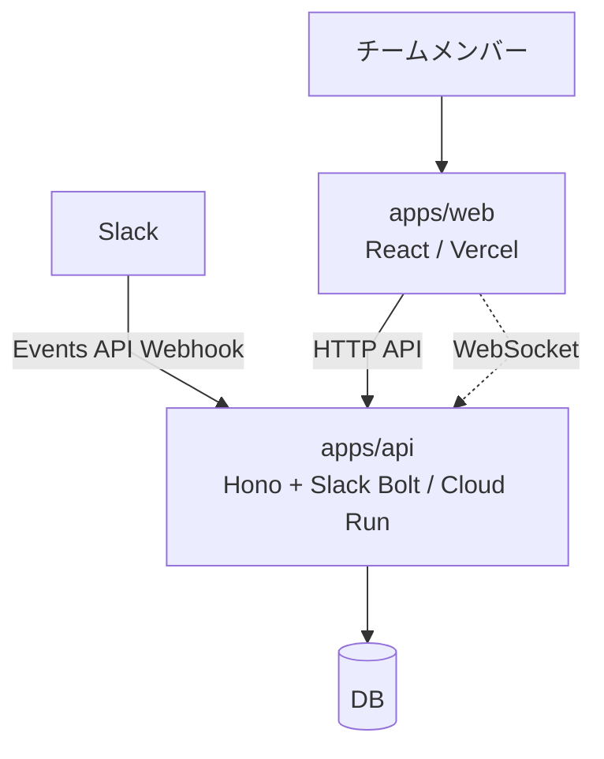

# architecture.md

## 1. システム概要

たま森は、チャットツール上の活動を元にユーザーごとの盆栽状態を更新し、フロントエンドへ表示・反映するサービスである。

MVPでは、フロントエンドとバックエンドを分離しつつ、バックエンドは単一のAPIサーバーとして構築する。



### 前提

- 初期対応チャットツールはSlackのみとする。
- フロントエンドとバックエンドは分離して構築する。
- バックエンドはBFFではなく、独立したAPIサーバーとして構築する。
- 投稿本文や会話履歴は保存しない。
- Slackイベントは内部の活動イベントへ変換して扱う。

## 2. 技術スタック

### apps/web

- React
- Vercel

### apps/api

- Hono
- Slack Bolt
- WebSocket
- Cloud Run

### データストア

- DBは未定。
- apps/apiのみがDBへアクセスする。
- apps/webはDBへ直接アクセスしない。

## 3. 主要ディレクトリ構成

```text
apps/
    web/
    api/

docs/
    requirement.md
    architecture.md
    api.md
    database.md
    adr/
```

### apps/web

- 自分の盆栽画面を表示する。
- チームの盆栽一覧画面を表示する。
- 初期表示時はHTTP APIで盆栽状態を取得する。
- 盆栽状態の更新はWebSocketで受け取る。

### apps/api

- HTTP APIを提供する。
- Slack Events APIのWebhookを受信する。
- Slackイベントを内部の活動イベントへ変換する。
- 活動ログを保存する。
- 盆栽状態を計算・保存する。
- 盆栽状態の更新をWebSocketで配信する。

## 4. 主要データフロー

### 初期表示

1. ユーザーがapps/webを開く。
2. apps/webがapps/apiのHTTP APIから現在の盆栽状態を取得する。
3. apps/webが自分の盆栽画面またはチームの盆栽一覧画面を表示する。

### Slackイベント処理

1. Slack Events APIからapps/apiへイベントが送信される。
2. apps/apiでSlackリクエストの署名を検証する。
3. Slackイベントを内部の活動イベントへ変換する。
4. 活動イベントを活動ログとして保存する。
5. 活動ログを元に、盆栽状態を計算して保存する。
6. 更新された盆栽状態をWebSocketでapps/webへ配信する。

### リアルタイム更新

1. apps/webがapps/apiのWebSocketを購読する。
2. 盆栽状態が更新された場合、apps/apiがWebSocketで更新を配信する。
3. apps/webが画面上の盆栽状態を更新する。
4. WebSocketが切断された場合、apps/webは再接続する。

## 5. 設計判断・関連ADR

### フロントエンドとバックエンドを分離する

- apps/webとapps/apiは分離して構築する。
- apps/webは画面表示に集中する。
- apps/apiはHTTP API、Slack Webhook受信、盆栽状態更新、WebSocket配信を担当する。

### バックエンドはBFFではなく独立したAPIサーバーとする

- apps/apiは単なるフロントエンド向けの中継層にはしない。
- Slackイベント処理、活動ログ記録、盆栽状態計算をバックエンドの責務として扱う。

### Slackイベントは内部活動イベントへ変換する

- Slack固有のイベント形式を、そのままアプリケーション全体で扱わない。
- Slackイベントは、サービス内部で扱う活動イベントへ変換してから保存・更新処理に渡す。
- 将来的に他のチャットツールへ拡張できるようにする。

### apps/apiはCloud Runにデプロイする

- Hono + Slack Boltを用いたバックエンドコンテナとして管理する。
- HTTP API、Slack Events API、WebSocketを1つのNode.jsバックエンドで扱う。
- Webhook受信時の速やかな応答、WebSocketの再接続、複数インスタンス時の状態同期を考慮する。

### 将来の切り出し方針

MVPではapps/apiがHTTP API、Slack Webhook受信、盆栽状態更新、WebSocket配信を担当する。

将来的にチャットツール連携やイベント処理が複雑になった場合、以下の責務を別パッケージまたは別アプリとして切り出す。

- Webhook受信
- イベント変換
- 盆栽状態計算
- WebSocket配信

### 関連ADR

現時点では未作成。
