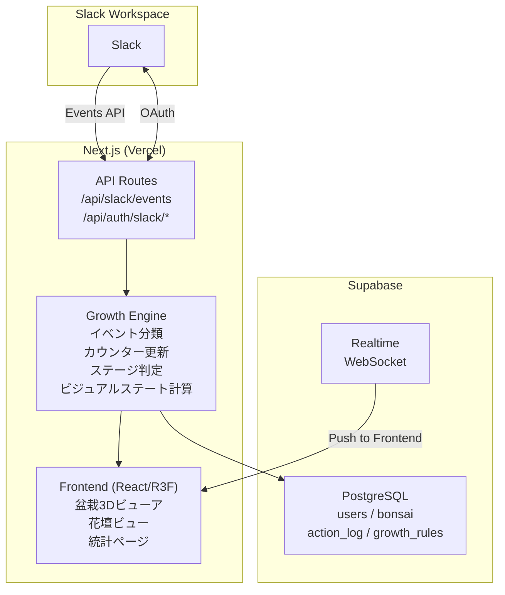
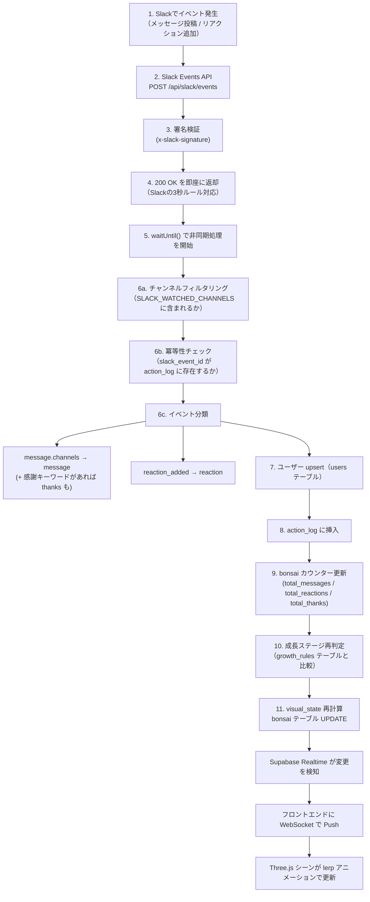
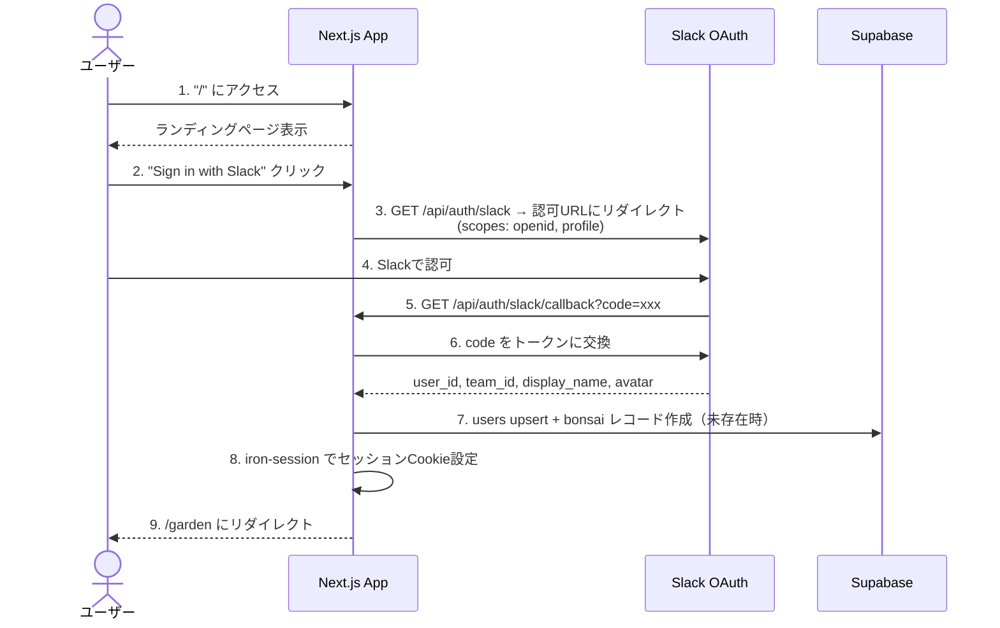
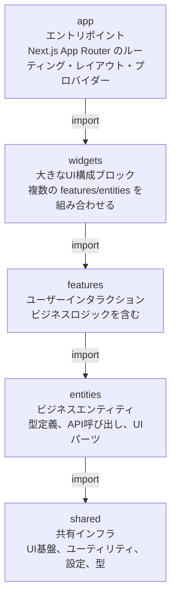
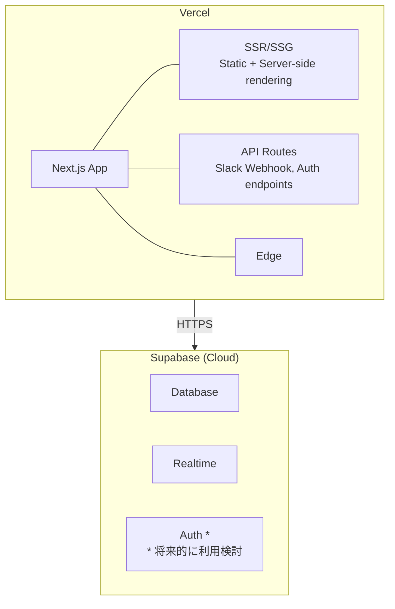

# アーキテクチャ構成

## システム全体像



## イベント処理フロー



## 認証フロー



## レイヤーアーキテクチャ (FSD)

本プロジェクトは Feature-Sliced Design (FSD) アーキテクチャを採用する。

### レイヤー構成と依存ルール



**依存ルール**: 上位レイヤーは下位レイヤーのみをインポートできる。同一レイヤー内の他スライスへのインポートは禁止。

### 各レイヤーの責務

| レイヤー | 責務                                   | このプロジェクトでの例                                                 |
| -------- | -------------------------------------- | ---------------------------------------------------------------------- |
| app      | ルーティング、レイアウト、プロバイダー | Next.js App Router のページ、Supabaseプロバイダー                      |
| widgets  | 画面を構成する大きなブロック           | BonsaiViewer（盆栽3Dビューア）、GardenViewer（花壇ビュー）、StatsPanel |
| features | ユーザー操作・ビジネスロジック         | Slack認証フロー、成長計算エンジン、リアルタイム同期                    |
| entities | ビジネスエンティティ                   | Bonsai（型, API, UI）、User、Action                                    |
| shared   | ビジネスロジックを持たない共有コード   | UIコンポーネント、Supabase/Slackクライアント、設定、型定義             |

### スライス内の構成（Segment）

各スライスは以下のセグメントで構成される:

```
feature-name/
├── index.ts          # Public API（外部に公開するもの）
├── ui/               # UIコンポーネント
├── model/            # ビジネスロジック、型定義、状態管理
├── api/              # API呼び出し、データフェッチ
└── lib/              # ユーティリティ関数
```

## デプロイアーキテクチャ



- **Vercel**: Next.jsアプリのホスティング。自動デプロイ（Git push）、プレビューデプロイ対応
- **Supabase**: マネージドPostgreSQL + Realtime。無料枠で十分な規模

## 設計判断の記録

| 判断                   | 選択                             | 理由                                                                                                                              |
| ---------------------- | -------------------------------- | --------------------------------------------------------------------------------------------------------------------------------- |
| 3D描画方式             | プロシージャル生成               | 各盆栽がユニークで連続変化するため。glTFモデルでは表現が制限される                                                                |
| visual_stateの保存場所 | サーバーサイド（DB）             | 全クライアントで同一の見た目を保証するため                                                                                        |
| 成長閾値の管理         | DBテーブル（growth_rules）       | デプロイなしで調整可能にするため                                                                                                  |
| セッション管理         | iron-session                     | Slackのみの単一OAuth。next-authより軽量                                                                                           |
| Slack連携方式          | Events API（リアルタイム）       | ポーリングでは盆栽成長のリアルタイム体験が損なわれる                                                                              |
| 非同期処理             | Vercel waitUntil()               | Slackの3秒ルール対応。DB処理をレスポンス後に実行                                                                                  |
| データ取得管理         | SWR（TanStack Queryではなく）    | フロントエンドがリードオンリーでミューテーション不要。軽量で3Dアプリに有利。詳細は [ADR-001](adr/001-swr-adoption.md)             |
| バリデーション         | Zod（Valibot・手動実装ではなく） | 型とバリデーションの一元化（`z.infer`）。Slackイベント判別に`discriminatedUnion`が最適。詳細は [ADR-002](adr/002-zod-adoption.md) |
