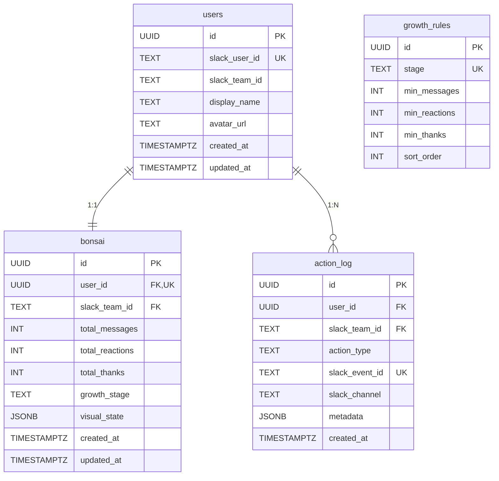

# データモデル設計

## ER図



## テーブル定義

### users

Slackユーザーとアプリユーザーを紐付けるテーブル。

```sql
CREATE TABLE users (
  id            UUID PRIMARY KEY DEFAULT gen_random_uuid(),
  slack_user_id TEXT UNIQUE NOT NULL,
  slack_team_id TEXT NOT NULL,
  display_name  TEXT NOT NULL,
  avatar_url    TEXT,
  created_at    TIMESTAMPTZ NOT NULL DEFAULT now(),
  updated_at    TIMESTAMPTZ NOT NULL DEFAULT now()
);

CREATE INDEX idx_users_slack_user_id ON users(slack_user_id);

-- マルチテナント分離 (#75): bonsai/action_log の複合 FK ターゲット
ALTER TABLE users ADD CONSTRAINT users_id_team_uk UNIQUE (id, slack_team_id);
```

| カラム        | 型          | 制約                          | 説明                                |
| ------------- | ----------- | ----------------------------- | ----------------------------------- |
| id            | UUID        | PK, DEFAULT gen_random_uuid() | 内部ID                              |
| slack_user_id | TEXT        | UNIQUE, NOT NULL              | Slack ユーザーID (例: U01XXXX)      |
| slack_team_id | TEXT        | NOT NULL, **immutable**       | Slack チームID。RLS の信頼根拠      |
| display_name  | TEXT        | NOT NULL                      | 表示名（Slackプロフィールから取得） |
| avatar_url    | TEXT        |                               | アバター画像URL                     |
| created_at    | TIMESTAMPTZ | NOT NULL, DEFAULT now()       | レコード作成日時                    |
| updated_at    | TIMESTAMPTZ | NOT NULL, DEFAULT now()       | レコード更新日時                    |

`slack_team_id` は **immutable トリガで UPDATE 禁止**。workspace 統合等で変更が必要な場合は ad-hoc migration でトリガを一時 DISABLE する運用 (本番導入時 TODO)。

### bonsai

各ユーザーの盆栽状態を管理するテーブル。1ユーザーにつき1レコード。

```sql
CREATE TABLE bonsai (
  id              UUID PRIMARY KEY DEFAULT gen_random_uuid(),
  user_id         UUID UNIQUE NOT NULL REFERENCES users(id) ON DELETE CASCADE,
  total_messages  INT NOT NULL DEFAULT 0,
  total_reactions INT NOT NULL DEFAULT 0,
  total_thanks    INT NOT NULL DEFAULT 0,
  growth_stage    TEXT NOT NULL DEFAULT 'seed'
                  CHECK (growth_stage IN (
                    'seed', 'sprout', 'young', 'branching',
                    'leafy', 'budding', 'flowering', 'full_bloom'
                  )),
  visual_state    JSONB NOT NULL DEFAULT '{
    "trunkHeight": 0.3,
    "trunkThickness": 0.05,
    "branches": [],
    "leaves": 0,
    "leafColor": "#228B22",
    "flowers": 0,
    "flowerColor": "#FFB7C5",
    "potColor": "#8B4513"
  }'::jsonb,
  created_at      TIMESTAMPTZ NOT NULL DEFAULT now(),
  updated_at      TIMESTAMPTZ NOT NULL DEFAULT now()
);

CREATE INDEX idx_bonsai_user_id ON bonsai(user_id);

-- #75: slack_team_id を denormalize し複合 FK + REPLICA IDENTITY FULL を設定
ALTER TABLE bonsai ADD COLUMN slack_team_id TEXT NOT NULL;
ALTER TABLE bonsai DROP CONSTRAINT bonsai_user_id_fkey;
ALTER TABLE bonsai ADD CONSTRAINT bonsai_user_team_fk
    FOREIGN KEY (user_id, slack_team_id) REFERENCES users (id, slack_team_id)
    ON DELETE CASCADE ON UPDATE NO ACTION;
CREATE INDEX idx_bonsai_slack_team_id ON bonsai(slack_team_id);
ALTER TABLE bonsai REPLICA IDENTITY FULL; -- Realtime + RLS の必須要件
```

| カラム          | 型          | 制約                                                        | 説明                        |
| --------------- | ----------- | ----------------------------------------------------------- | --------------------------- |
| id              | UUID        | PK                                                          | 内部ID                      |
| user_id         | UUID        | UNIQUE, NOT NULL (複合 FK の一部)                           | 所有ユーザー                |
| slack_team_id   | TEXT        | NOT NULL, **immutable**, 複合 FK → users(id, slack_team_id) | テナント識別 (RLS の判定列) |
| total_messages  | INT         | NOT NULL, DEFAULT 0                                         | メッセージ投稿の累計数      |
| total_reactions | INT         | NOT NULL, DEFAULT 0                                         | リアクション追加の累計数    |
| total_thanks    | INT         | NOT NULL, DEFAULT 0                                         | 感謝メッセージの累計数      |
| growth_stage    | TEXT        | NOT NULL, CHECK制約                                         | 現在の成長ステージ          |
| visual_state    | JSONB       | NOT NULL                                                    | Three.js描画用パラメータ    |
| created_at      | TIMESTAMPTZ | NOT NULL                                                    | レコード作成日時            |
| updated_at      | TIMESTAMPTZ | NOT NULL                                                    | レコード更新日時            |

`slack_team_id` は **複合 FK + immutable トリガ** で物理的に整合性が保証される。
`REPLICA IDENTITY FULL` は postgres_changes RLS が WAL の slack_team_id を読み取る
ために必要 (DEFAULT では PK + 変更列のみ送信されるため、不変な slack_team_id が
WAL に乗らず RLS が評価できない)。

### action_log

Slackイベントの記録。追記専用（UPDATE/DELETE なし）。統計・履歴・監査に使用。

```sql
CREATE TABLE action_log (
  id              UUID PRIMARY KEY DEFAULT gen_random_uuid(),
  user_id         UUID NOT NULL REFERENCES users(id) ON DELETE CASCADE,
  action_type     TEXT NOT NULL CHECK (action_type IN ('message', 'reaction', 'thanks')),
  slack_event_id  TEXT UNIQUE,
  slack_channel   TEXT,
  metadata        JSONB NOT NULL DEFAULT '{}',
  created_at      TIMESTAMPTZ NOT NULL DEFAULT now()
);

CREATE INDEX idx_action_log_user_created ON action_log(user_id, created_at DESC);
CREATE INDEX idx_action_log_event_id ON action_log(slack_event_id);
CREATE INDEX idx_action_log_type ON action_log(action_type, created_at DESC);

-- #75: slack_team_id を denormalize し複合 FK + REPLICA IDENTITY FULL を設定
ALTER TABLE action_log ADD COLUMN slack_team_id TEXT NOT NULL;
ALTER TABLE action_log DROP CONSTRAINT action_log_user_id_fkey;
ALTER TABLE action_log ADD CONSTRAINT action_log_user_team_fk
    FOREIGN KEY (user_id, slack_team_id) REFERENCES users (id, slack_team_id)
    ON DELETE CASCADE ON UPDATE NO ACTION;
CREATE INDEX idx_action_log_slack_team_id ON action_log(slack_team_id);
ALTER TABLE action_log REPLICA IDENTITY FULL;
```

| カラム         | 型          | 制約                                                        | 説明                                        |
| -------------- | ----------- | ----------------------------------------------------------- | ------------------------------------------- |
| id             | UUID        | PK                                                          | 内部ID                                      |
| user_id        | UUID        | NOT NULL (複合 FK の一部)                                   | アクション実行ユーザー                      |
| slack_team_id  | TEXT        | NOT NULL, **immutable**, 複合 FK → users(id, slack_team_id) | テナント識別 (RLS の判定列)                 |
| action_type    | TEXT        | NOT NULL, CHECK制約                                         | アクション種別: message / reaction / thanks |
| slack_event_id | TEXT        | UNIQUE                                                      | Slack event_id（冪等性キー）                |
| slack_channel  | TEXT        |                                                             | イベント発生チャンネルID                    |
| metadata       | JSONB       | NOT NULL, DEFAULT '{}'                                      | 付加情報                                    |
| created_at     | TIMESTAMPTZ | NOT NULL                                                    | イベント発生日時                            |

#### metadata の例

```jsonc
// message アクション
{ "text_snippet": "今日もがんばりましょう！" }

// reaction アクション
{ "emoji": "thumbsup", "target_ts": "1234567890.123456" }

// thanks アクション
{ "text_snippet": "ありがとうございます！", "keyword": "ありがとう" }
```

### growth_rules

成長ステージの閾値を管理する設定テーブル。デプロイなしで閾値を調整可能にする。

```sql
CREATE TABLE growth_rules (
  id            UUID PRIMARY KEY DEFAULT gen_random_uuid(),
  stage         TEXT UNIQUE NOT NULL,
  min_messages  INT NOT NULL,
  min_reactions INT NOT NULL,
  min_thanks    INT NOT NULL,
  sort_order    INT NOT NULL
);

-- 初期データ
INSERT INTO growth_rules (stage, min_messages, min_reactions, min_thanks, sort_order) VALUES
  ('seed',        0,   0,   0,  0),
  ('sprout',      5,   0,   0,  1),
  ('young',      15,   5,   0,  2),
  ('branching',  30,  15,   3,  3),
  ('leafy',      60,  30,  10,  4),
  ('budding',   100,  50,  20,  5),
  ('flowering', 150,  80,  35,  6),
  ('full_bloom', 250, 120,  60,  7);
```

| カラム        | 型   | 制約             | 説明                   |
| ------------- | ---- | ---------------- | ---------------------- |
| id            | UUID | PK               | 内部ID                 |
| stage         | TEXT | UNIQUE, NOT NULL | ステージ名             |
| min_messages  | INT  | NOT NULL         | 必要最低メッセージ数   |
| min_reactions | INT  | NOT NULL         | 必要最低リアクション数 |
| min_thanks    | INT  | NOT NULL         | 必要最低感謝数         |
| sort_order    | INT  | NOT NULL         | ステージの順序（昇順） |

#### ステージ判定ロジック

現在のステージは、`total_messages >= min_messages AND total_reactions >= min_reactions AND total_thanks >= min_thanks` を満たす最も `sort_order` が高い行に一致する。3種のアクションすべてのバランスが求められる設計。

## visual_state (JSONB) 構造定義

盆栽の3D描画に必要な全パラメータをJSONBで保持する。サーバーサイドで計算し、全クライアントが同一の見た目を描画できるようにする。

### TypeScript 型定義

```typescript
interface BonsaiVisualState {
    trunkHeight: number; // 幹の高さ (0.3 ~ 2.0)
    trunkThickness: number; // 幹の太さ (0.05 ~ 0.25)
    branches: Branch[]; // 枝の配列
    leaves: number; // 葉の総数 (0 ~ 80)
    leafColor: string; // 葉の色 (hex)
    flowers: number; // 花の総数 (0 ~ 30)
    flowerColor: string; // 花の色 (hex)
    potColor: string; // 鉢の色 (hex)
}

interface Branch {
    angle: number; // 枝の角度 (度数法)
    length: number; // 枝の長さ
    depth: number; // 枝の階層 (1 = 幹から直接, 2 = 枝から分岐)
    seed: number; // 決定的乱数シード (描画の再現性確保)
}
```

### 計算式

```
trunkHeight    = min(2.0,  0.3  + totalMessages  * 0.007)
trunkThickness = min(0.25, 0.05 + totalMessages  * 0.001)
branchCount    = min(20,   floor(totalMessages / 8))
leaves         = min(80,   floor(totalReactions / 2))
flowers        = min(30,   floor(totalThanks / 3))
```

### 枝の決定的生成

各枝の `angle` と `seed` は `hash(userId + branchIndex)` から決定的に生成する。これにより:

- 同じユーザーの盆栽は常に同じ形状になる
- 新しい枝が追加されても、既存の枝の位置は変わらない
- 異なるクライアントで同じ見た目が保証される

## Supabase Realtime 設定

`bonsai` テーブルのRealtimeを有効化する。

```sql
-- Supabase のリアルタイム機能を bonsai テーブルに対して有効化
ALTER PUBLICATION supabase_realtime ADD TABLE bonsai;

-- #75: postgres_changes RLS を成立させる必須要件
ALTER TABLE bonsai REPLICA IDENTITY FULL;
ALTER TABLE action_log REPLICA IDENTITY FULL;
```

フロントエンドは `postgres_changes` イベントの `UPDATE` を購読し、`visual_state` や `growth_stage` の変更を検知する。

### Realtime + RLS 成立の必須条件 (PoC 由来 / ADR-004 §決定 6)

1. **subscribe 前の explicit `await supabase.realtime.setAuth(jwt)`**
   `accessToken` 関数オプションの auto-setAuth は fire-and-forget で race するため、
   subscribe を直後に呼ぶと WebSocket は anon ロールで RLS を評価し他テナント
   UPDATE が漏れる。Realtime hook 側で必ず明示的に await する。
2. **RLS ポリシーは自テーブルの `slack_team_id` を直接参照**
   JOIN/EXISTS で他テーブルを引く形は postgres_changes で評価できない。
3. **`bonsai` / `action_log` を `REPLICA IDENTITY FULL`**
   DEFAULT では PK と変更カラムしか WAL に乗らず、`slack_team_id` を変更しない
   通常 UPDATE では RLS が判定できなくなる。

## updated_at の自動更新

```sql
-- updated_at を自動更新するトリガー関数
CREATE OR REPLACE FUNCTION update_updated_at()
RETURNS TRIGGER AS $$
BEGIN
  NEW.updated_at = now();
  RETURN NEW;
END;
$$ LANGUAGE plpgsql;

-- users テーブル
CREATE TRIGGER trigger_users_updated_at
  BEFORE UPDATE ON users
  FOR EACH ROW EXECUTE FUNCTION update_updated_at();

-- bonsai テーブル
CREATE TRIGGER trigger_bonsai_updated_at
  BEFORE UPDATE ON bonsai
  FOR EACH ROW EXECUTE FUNCTION update_updated_at();
```

## RLS ポリシー (#75 で導入)

`iron-session` 由来の独自 JWT (`slack_team_id` claim) を `authenticated` ロールで
流し、自テナント行のみ SELECT を許可する。詳細は ADR-004 を参照。

### 設計原則

- **ポリシーは自テーブルの `slack_team_id` を直接参照**する。`users` JOIN や
  EXISTS は postgres_changes RLS で評価できないため使わない (PoC で実証済み)。
- 書き込み (INSERT/UPDATE/DELETE) はアプリ層の `service_role` 経由のみで行うため
  ポリシーを追加しない (= デフォルト DENY)。`service_role` は RLS をバイパスする。
- `growth_rules` はテナント非依存のため authenticated 全員 SELECT 可。

### ポリシー定義

```sql
CREATE POLICY "authenticated_select_users"
  ON users FOR SELECT TO authenticated
  USING (slack_team_id = (auth.jwt() ->> 'slack_team_id'));

CREATE POLICY "authenticated_select_bonsai"
  ON bonsai FOR SELECT TO authenticated
  USING (slack_team_id = (auth.jwt() ->> 'slack_team_id'));

CREATE POLICY "authenticated_select_action_log"
  ON action_log FOR SELECT TO authenticated
  USING (slack_team_id = (auth.jwt() ->> 'slack_team_id'));

CREATE POLICY "authenticated_select_growth_rules"
  ON growth_rules FOR SELECT TO authenticated
  USING (true);
```

### 多層防御の役割分担

| 経路                   | アクセスキー                | RLS 評価 | 防御主体                 |
| ---------------------- | --------------------------- | -------- | ------------------------ |
| Server Component / SSR | `service_role`              | バイパス | アプリ層 (唯一)          |
| Entity API (server)    | `service_role`              | バイパス | アプリ層 (唯一)          |
| ブラウザ SWR fetch     | `anon` + 独自 JWT           | 効く     | RLS + アプリ層 (二重)    |
| ブラウザ Realtime 購読 | `anon` + 独自 JWT + setAuth | 効く     | RLS + 購読 filter (二重) |
| 書き込み               | `service_role`              | バイパス | アプリ層 (唯一)          |

## マイグレーションファイル一覧

| ファイル                            | 内容                                                                                           |
| ----------------------------------- | ---------------------------------------------------------------------------------------------- |
| `001_create_users.sql`              | users テーブル + インデックス + updated_at トリガー                                            |
| `002_create_bonsai.sql`             | bonsai テーブル + インデックス + updated_at トリガー                                           |
| `003_create_action_log.sql`         | action_log テーブル + インデックス                                                             |
| `004_create_growth_rules.sql`       | growth_rules テーブル + 初期データ                                                             |
| `005_enable_realtime.sql`           | bonsai テーブルの Realtime 有効化                                                              |
| `006_enable_rls.sql`                | 全テーブルの RLS 有効化 + anon SELECT ポリシー                                                 |
| `007_denormalize_slack_team_id.sql` | bonsai/action_log に slack_team_id 列追加 + 複合 FK + REPLICA IDENTITY FULL + immutable トリガ |
| `008_tenant_rls.sql`                | authenticated 向け SELECT ポリシー追加 + 旧 anon ポリシー DROP                                 |
