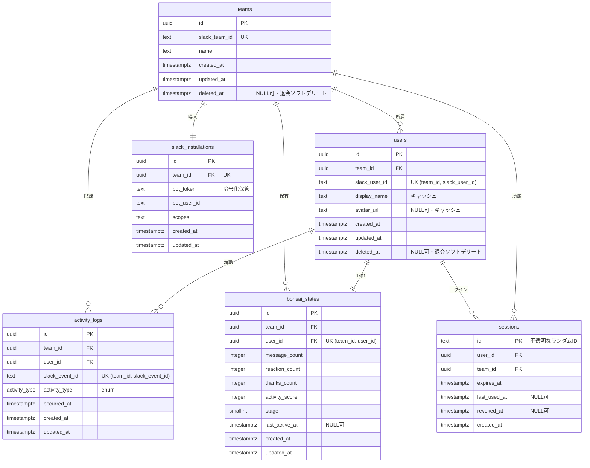

# データベース設計

> たま森が保持するデータの構造を定義する。**活動ログを正**とし、**盆栽状態は現在値のスナップショット**として扱う。DB へアクセスするのは apps/api のみ（apps/web は HTTP API 経由）。採用理由は [architecture.md](architecture.md) §4、認証まわりの保管は [architecture.md](architecture.md) §9・[ADR-009](adr/009-auth-architecture.md)、用語は [glossary.md](glossary.md) を参照。

## 1. 概要

- Slack イベントを受け取り、内部の活動イベントへ変換した結果を保存する。投稿本文や会話履歴は保存しない。
- 盆栽状態は活動ログを元に更新する。
- マルチテナントのため、ワークスペースの**インストール情報（bot トークン）**と**利用者セッション**も保持する。
- DB には **PostgreSQL** を採用する（[ADR-001](adr/001-postgresql-adoption.md)）。アクセス層は **Drizzle ORM**（[ADR-002](adr/002-drizzle-orm-adoption.md)）、ホスティングは **Cloud SQL**（[ADR-003](adr/003-cloud-sql-hosting.md)）。

ドメイン概念（要件定義）と物理名の対応:

| ドメイン概念 | エンティティ | テーブル |
| --- | --- | --- |
| チーム | `Team` | `teams` |
| ユーザー | `User` | `users` |
| 活動ログ | `ActivityLog` | `activity_logs` |
| 盆栽状態 | `BonsaiState` | `bonsai_states` |
| インストール（認証情報） | `SlackInstallation` | `slack_installations` |
| セッション | `Session` | `sessions` |

## 2. ER 図

各レコードはチーム単位で分離する（テナント分離）。ユーザー・盆栽状態・セッションを取得する際は、必ず `team_id` を条件に含める（§5）。

## 3. テーブル定義

共通方針: 主キー `id` と外部キー（`team_id` / `user_id` 等）は `uuid` 型とし、主キーの既定値は `gen_random_uuid()`。日時は `timestamptz`。例外として `sessions.id` は不透明なランダム文字列（`text`）。

### 3.1 teams

Slack ワークスペースを管理する。

| カラム | 型 | NULL可 | キー | 既定値 | 説明 |
| --- | --- | --- | --- | --- | --- |
| `id` | `uuid` | 不可 | PK | `gen_random_uuid()` | — |
| `slack_team_id` | `text` | 不可 | UNIQUE | — | Slack チーム ID |
| `name` | `text` | 不可 | — | — | チーム名 |
| `created_at` | `timestamptz` | 不可 | — | `now()` | 作成日時（＝インストール日時） |
| `updated_at` | `timestamptz` | 不可 | — | `now()` | 更新日時 |
| `deleted_at` | `timestamptz` | 可 | — | — | 退会（アンインストール）ソフトデリート時刻。猶予後ハード削除 |

### 3.2 users

チーム内の Slack ユーザーを管理する。

| カラム | 型 | NULL可 | キー | 既定値 | 説明 |
| --- | --- | --- | --- | --- | --- |
| `id` | `uuid` | 不可 | PK | `gen_random_uuid()` | — |
| `team_id` | `uuid` | 不可 | FK → `teams.id` | — | 所属チーム |
| `slack_user_id` | `text` | 不可 | UNIQUE `(team_id, slack_user_id)` | — | Slack ユーザー ID |
| `display_name` | `text` | 不可 | — | — | 表示名（**キャッシュ**。サインイン/`users.info` で更新） |
| `avatar_url` | `text` | 可 | — | — | アイコン画像 URL（**キャッシュ**） |
| `created_at` | `timestamptz` | 不可 | — | `now()` | 作成日時 |
| `updated_at` | `timestamptz` | 不可 | — | `now()` | 更新日時 |
| `deleted_at` | `timestamptz` | 可 | — | — | 退会ソフトデリート時刻。猶予後ハード削除 |

ユーザーは**サインイン（OIDC）とイベント受信の両経路で `(team_id, slack_user_id)` upsert** される。`display_name`/`avatar_url` はミュータブルなキャッシュとして扱い、サインイン（OIDC claim）または `users.info` で更新する（[ADR-011](adr/011-tenant-provisioning-lifecycle.md)）。

### 3.3 activity_logs

ユーザーの活動を記録する。活動種別 `activity_type` の値は [glossary.md](glossary.md) §5 を参照。

| カラム | 型 | NULL可 | キー | 既定値 | 説明 |
| --- | --- | --- | --- | --- | --- |
| `id` | `uuid` | 不可 | PK | `gen_random_uuid()` | — |
| `team_id` | `uuid` | 不可 | FK → `teams.id` | — | — |
| `user_id` | `uuid` | 不可 | FK → `users.id` | — | — |
| `slack_event_id` | `text` | 不可 | UNIQUE `(team_id, slack_event_id)` | — | Slack イベント ID。重複処理防止に用いる |
| `activity_type` | `activity_type`（enum） | 不可 | — | — | 活動種別（`message` / `reaction` / `thanks`） |
| `occurred_at` | `timestamptz` | 不可 | — | — | 活動日時（Slack 上で発生した時刻） |
| `created_at` | `timestamptz` | 不可 | — | `now()` | 記録日時 |
| `updated_at` | `timestamptz` | 不可 | — | `now()` | 更新日時 |

`activity_type` は Postgres の enum 型として定義し、MVP では `message` / `reaction` / `thanks` を扱う。

### 3.4 bonsai_states

ユーザーごとの現在の盆栽状態を管理する。各値の意味・保存有無は [glossary.md](glossary.md) §3 を参照。

| カラム | 型 | NULL可 | キー | 既定値 | 説明 |
| --- | --- | --- | --- | --- | --- |
| `id` | `uuid` | 不可 | PK | `gen_random_uuid()` | — |
| `team_id` | `uuid` | 不可 | FK → `teams.id` | — | — |
| `user_id` | `uuid` | 不可 | FK → `users.id`, UNIQUE `(team_id, user_id)` | — | 1 ユーザー 1 状態 |
| `message_count` | `integer` | 不可 | — | `0` | 発言数（内部値。API には出さない） |
| `reaction_count` | `integer` | 不可 | — | `0` | リアクション数（内部値） |
| `thanks_count` | `integer` | 不可 | — | `0` | 感謝数（内部値） |
| `activity_score` | `integer` | 不可 | — | `0` | 重み付き和。`stage` 判定用（内部値） |
| `stage` | `smallint` | 不可 | — | `1` | 成長段階（1..6、6 は維持フェーズ）。単調・不可逆 |
| `last_active_at` | `timestamptz` | 可 | — | — | 最終活動時刻。`vitality` の算出元 |
| `created_at` | `timestamptz` | 不可 | — | `now()` | 作成日時 |
| `updated_at` | `timestamptz` | 不可 | — | `now()` | 更新日時 |

補足:

- `activity_score` は発言・リアクション・感謝の各カウントに重みを掛けた和で、`stage` の判定に用いる。
- `stage` は成長段階の序数（1..6、終端の 6 は維持フェーズ）。後退しない（単調・不可逆）。
- 成長ルール（活動種別ごとの重み、`activity_score` から `stage` を決める閾値）は apps/api のコード定数を正とし、DB には計算結果（`activity_score` / `stage`）のみを保持する。重み・閾値のテーブルは設けない（[ADR-006](adr/006-growth-rules-as-code.md)）。
- `last_active_at` の源泉は `activity_logs.occurred_at`。最新の活動時刻を `bonsai_states` に非正規化して保持し、活力（`vitality`）の算出に用いる（[visual.md](visual.md) §4）。未活動のユーザーでは NULL を許容する。

### 3.5 slack_installations

マルチテナントのインストールストア。ワークスペースが Slack アプリを導入した際の認証情報を保持する（[ADR-009](adr/009-auth-architecture.md) 層1・[ADR-010](adr/010-slack-hono-receiver.md)）。

| カラム | 型 | NULL可 | キー | 既定値 | 説明 |
| --- | --- | --- | --- | --- | --- |
| `id` | `uuid` | 不可 | PK | `gen_random_uuid()` | — |
| `team_id` | `uuid` | 不可 | FK → `teams.id`, UNIQUE | — | 1 ワークスペース 1 インストール |
| `bot_token` | `text` | 不可 | — | — | bot トークン。**認証情報のため暗号化して保管**（§5.2） |
| `bot_user_id` | `text` | 不可 | — | — | bot のユーザー ID |
| `scopes` | `text` | 不可 | — | — | 付与された bot スコープ |
| `created_at` | `timestamptz` | 不可 | — | `now()` | インストール日時 |
| `updated_at` | `timestamptz` | 不可 | — | `now()` | 更新日時（再インストール時） |

- インストール時に `teams` と本テーブルを **`slack_team_id`/`team_id` で upsert**（create-or-join）。再インストールは `bot_token` を上書き（古いトークンは保持しない）。
- **アンインストール/`tokens_revoked` で本行を即時削除**（bot トークン破棄）。
- 将来トークンローテーションを導入する場合は `bot_refresh_token` / `bot_token_expires_at` を追加する（MVP では無効。TODO）。
- Enterprise Grid の org-wide install は **MVP 非対応**（team 単位のみ）。対応時は `enterprise_id`（NULL可）を追加する。

### 3.6 sessions

利用者セッションストア。Sign in with Slack（OIDC）後のセッションを保持する（[ADR-009](adr/009-auth-architecture.md) 層3）。Cookie には `id` のみを載せる。

| カラム | 型 | NULL可 | キー | 既定値 | 説明 |
| --- | --- | --- | --- | --- | --- |
| `id` | `text` | 不可 | PK | — | 不透明なランダム session ID（Cookie 値） |
| `user_id` | `uuid` | 不可 | FK → `users.id` | — | セッションの主体 |
| `team_id` | `uuid` | 不可 | FK → `teams.id` | — | テナント分離用 |
| `expires_at` | `timestamptz` | 不可 | — | — | 有効期限 |
| `last_used_at` | `timestamptz` | 可 | — | — | 最終利用時刻 |
| `revoked_at` | `timestamptz` | 可 | — | — | 失効時刻（任意。行削除でも失効可） |
| `created_at` | `timestamptz` | 不可 | — | `now()` | 作成日時 |

- ログアウト＝該当行削除、全端末失効＝`user_id` 単位削除、テナント退会＝`team_id` 単位一括削除で**即時失効**する。

## 4. 保存・更新方針

### 4.1 Slack イベント受信

Slack イベント受信時は、以下の順序で処理する（フロー全体は [architecture.md](architecture.md) §8.2）。

1. Slack リクエストを検証する（署名）。
2. Slack イベントを内部の活動イベントへ変換する。
3. チームとユーザーを識別し、必要に応じて作成または更新する。
4. 活動ログを保存する。
5. 活動ログが**新規に保存された場合のみ**、盆栽状態を更新する（該当カウントの加算 → `activity_score` の再計算 → `stage` の再判定 → `last_active_at` を `GREATEST(現在値, 新しい occurred_at)` で更新）。

- 活動ログ保存と盆栽状態更新は同一トランザクションで扱う。
- 同一 Slack イベント（`slack_event_id`）を受信した場合は、活動ログを重複保存せず、盆栽状態も更新しない。

### 4.2 マイグレーション運用

- Drizzle でスキーマを管理する。`drizzle-kit generate` した **SQL をコミット**し、**配信前に別ステップで `migrate()` を実行**する（複数インスタンス同時起動の競合を避ける）。
- 本番で `drizzle-kit push` は使わない（履歴を残さずスキーマを変更する危険がある）。詳細は [architecture.md](architecture.md) §6。

## 5. インデックス・制約・データ保護

### 5.1 インデックス・制約

| 制約 / インデックス | 対象 | 種別 | 目的 |
| --- | --- | --- | --- |
| チーム一意 | `teams(slack_team_id)` | UNIQUE | Slack チームの識別 |
| ユーザー一意 | `users(team_id, slack_user_id)` | UNIQUE | チーム内ユーザーの識別 |
| 盆栽状態一意 | `bonsai_states(team_id, user_id)` | UNIQUE | 1 ユーザー 1 状態 |
| イベント一意 | `activity_logs(team_id, slack_event_id)` | UNIQUE | Slack イベントの重複処理防止 |
| インストール一意 | `slack_installations(team_id)` | UNIQUE | 1 ワークスペース 1 インストール |
| チーム索引 | `users(team_id)` / `bonsai_states(team_id)` | INDEX | チームの盆栽一覧取得 |
| 活動履歴索引 | `activity_logs(user_id, occurred_at)` | INDEX | ユーザーの活動履歴参照 |
| セッション索引 | `sessions(user_id)` / `sessions(expires_at)` | INDEX | 失効（user 単位削除）・期限切れ掃除 |

### 5.2 データ保護

以下は保存しない。Slack イベントの内容は活動種別の判定と感謝表現の検出にのみ利用する。

- 投稿本文 / チャンネル内の会話履歴 / Slack イベント payload 全体 / 添付ファイル / リンク先の内容 / リアクション対象の投稿本文

保存するデータは、チーム・ユーザー・活動種別・活動日時・盆栽状態の更新に必要な最小限に限定する。**認証情報（`slack_installations.bot_token`）は暗号化して保管**する（アプリ層での暗号化、または Secret Manager 参照）。チームごとのデータが他チームに見えないよう、DB アクセス時は `team_id` による絞り込みを必須とする（テナント分離）。

### 5.3 アンインストール／退会のライフサイクル

ワークスペースのアンインストール（`app_uninstalled`）時は、以下を**冪等・順序非依存**に行う（[ADR-011](adr/011-tenant-provisioning-lifecycle.md)、検知は [api.md](api.md) §5）。

- **即時破棄**: `slack_installations`（bot トークン）と当該 `team_id` の `sessions` を削除する。
- **猶予付きソフトデリート**: `teams` / `users` / `activity_logs` / `bonsai_states` に `deleted_at` を打ち、**約30日後に背景ジョブでハード削除**する。猶予中の再インストールで復元する。
- **DSR（削除要求）**: 猶予を待たず即時ハード削除するパスを用意する。
- 通常参照クエリは `deleted_at IS NULL` で絞る。

## 関連リンク

- [architecture.md](architecture.md) — 技術スタック・データフロー・認証（§9）
- [api.md](api.md) — レスポンス構造（`render` / `season`）・認証フロー
- [visual.md](visual.md) — `stage` / `vitality` の見た目
- [glossary.md](glossary.md) — 用語集
- [ADR-001](adr/001-postgresql-adoption.md) / [ADR-002](adr/002-drizzle-orm-adoption.md) / [ADR-003](adr/003-cloud-sql-hosting.md) / [ADR-006](adr/006-growth-rules-as-code.md) / [ADR-009](adr/009-auth-architecture.md)
