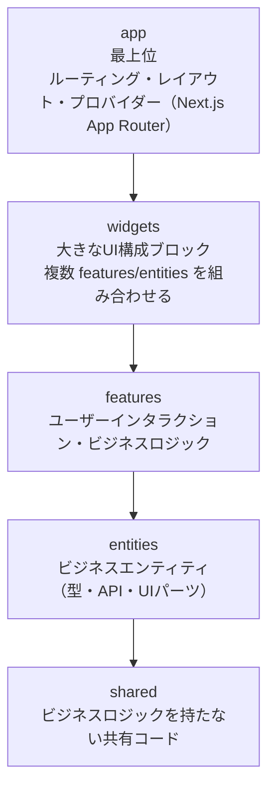

# ディレクトリ構成

## アーキテクチャ: Feature-Sliced Design (FSD)

本プロジェクトはFSD (Feature-Sliced Design) アーキテクチャを採用する。Next.js App Router との統合方針も併記する。

## FSD レイヤー概要



**依存ルール**: 上位レイヤーは下位レイヤーのみをインポートできる。同一レイヤー内の他スライスへの直接インポートは禁止。

## ディレクトリツリー

```
tamamori/
├── docs/                                    # SSoTドキュメント
│   ├── requirements.md                      #   要件定義
│   ├── architecture.md                      #   アーキテクチャ構成
│   ├── tech-stack.md                        #   技術スタック
│   ├── directory-structure.md               #   ディレクトリ構成（本ファイル）
│   ├── api-design.md                        #   API設計
│   ├── data-model.md                        #   データモデル設計
│   └── adr/                                 #   Architecture Decision Records
│       ├── 001-swr-adoption.md              #     データ取得ライブラリとしてSWR採用
│       └── 002-zod-adoption.md              #     バリデーションライブラリとしてZod採用
│
├── supabase/
│   └── migrations/                          # DBマイグレーションSQL
│       ├── 001_create_users.sql
│       ├── 002_create_bonsai.sql
│       ├── 003_create_action_log.sql
│       ├── 004_create_growth_rules.sql
│       └── 005_enable_realtime.sql
│
├── public/
│   └── favicon.ico
│
├── src/
│   ├── app/                                 # ===== FSD: app 層 =====
│   │   │                                    # Next.js App Router のルーティング・レイアウト
│   │   ├── layout.tsx                       # ルートレイアウト（SWRConfig, プロバイダー設定）
│   │   ├── page.tsx                         # / ランディング・サインイン
│   │   ├── (pages)/                         # ルートグループ（URLに影響しない）
│   │   │   ├── garden/
│   │   │   │   └── page.tsx                 # /garden 花壇ビュー
│   │   │   ├── bonsai/
│   │   │   │   ├── me/
│   │   │   │   │   └── page.tsx             # /bonsai/me → 自分の盆栽へリダイレクト
│   │   │   │   └── [userId]/
│   │   │   │       └── page.tsx             # /bonsai/:userId 個別盆栽ページ
│   │   │   └── stats/
│   │   │       └── page.tsx                 # /stats 統計ページ
│   │   └── api/
│   │       ├── slack/
│   │       │   └── events/
│   │       │       └── route.ts             # POST /api/slack/events Webhook
│   │       └── auth/
│   │           └── slack/
│   │               ├── route.ts             # GET /api/auth/slack OAuth開始
│   │               └── callback/
│   │                   └── route.ts         # GET /api/auth/slack/callback
│   │
│   ├── widgets/                             # ===== FSD: widgets 層 =====
│   │   │                                    # 画面を構成する大きなUIブロック
│   │   ├── bonsai-viewer/                   # 盆栽3Dビューア
│   │   │   ├── index.ts                     #   Public API
│   │   │   └── ui/
│   │   │       ├── BonsaiViewer.tsx          #   Canvas + 盆栽 + ステータスパネル
│   │   │       └── BonsaiStatusPanel.tsx     #   成長ステージ・進捗表示
│   │   ├── garden-viewer/                   # 花壇3Dビューア
│   │   │   ├── index.ts
│   │   │   └── ui/
│   │   │       ├── GardenViewer.tsx          #   複数盆栽の3Dシーン
│   │   │       └── GardenBonsaiLabel.tsx     #   盆栽の名前ラベル
│   │   └── stats-panel/                     # 統計パネル
│   │       ├── index.ts
│   │       └── ui/
│   │           ├── GrowthTimeline.tsx        #   日別アクティビティチャート
│   │           └── ActionBreakdown.tsx       #   アクション種別内訳
│   │
│   ├── features/                            # ===== FSD: features 層 =====
│   │   │                                    # ユーザーインタラクション・ビジネスロジック
│   │   ├── slack-auth/                      # Slack OAuth 認証
│   │   │   ├── index.ts
│   │   │   ├── api/
│   │   │   │   └── slack-oauth.ts           #   OAuth トークン交換、ユーザー情報取得
│   │   │   ├── model/
│   │   │   │   └── session.ts               #   iron-session 設定、セッション型定義
│   │   │   └── lib/
│   │   │       ├── verify-signature.ts      #   Slack 署名検証
│   │   │       ├── slack-event-schema.ts    #   Slackイベントペイロードの Zod スキーマ
│   │   │       └── slack-oauth-schema.ts    #   OAuthレスポンスの Zod スキーマ
│   │   │
│   │   ├── bonsai-growth/                   # 盆栽成長計算
│   │   │   ├── index.ts
│   │   │   ├── model/
│   │   │   │   ├── growth-engine.ts         #   ステージ判定、ビジュアルステート計算
│   │   │   │   └── growth-rules.ts          #   成長ルール型定義・取得
│   │   │   └── lib/
│   │   │       ├── classify-event.ts        #   Slackイベント分類
│   │   │       └── hash.ts                  #   決定的ハッシュ関数
│   │   └── realtime-sync/                   # リアルタイム同期（Realtime → SWR mutate）
│   │       ├── index.ts
│   │       └── model/
│   │           ├── use-bonsai-realtime.ts   #   単一盆栽のRealtime購読 + SWRキャッシュ更新
│   │           └── use-all-bonsai.ts        #   全盆栽のRealtime購読 + SWRキャッシュ更新
│   │
│   ├── entities/                            # ===== FSD: entities 層 =====
│   │   │                                    # ビジネスエンティティ
│   │   ├── bonsai/                          # 盆栽エンティティ
│   │   │   ├── index.ts
│   │   │   ├── model/
│   │   │   │   └── types.ts                 #   Zodスキーマ + 型導出（BonsaiVisualState, GrowthStage）
│   │   │   ├── api/
│   │   │   │   └── bonsai-api.ts            #   SWRフック（useBonsai, useAllBonsai）
│   │   │   └── ui/
│   │   │       ├── BonsaiScene.tsx           #   3Dシーン（Canvas, ライティング）
│   │   │       ├── Bonsai.tsx               #   盆栽コンポーネント（全パーツ統合）
│   │   │       ├── Trunk.tsx                #   幹
│   │   │       ├── Branch.tsx               #   枝（再帰的）
│   │   │       ├── Leaves.tsx               #   葉（InstancedMesh）
│   │   │       ├── Flowers.tsx              #   花（InstancedMesh）
│   │   │       ├── Pot.tsx                  #   鉢
│   │   │       └── GrowthParticles.tsx      #   ステージ昇格エフェクト
│   │   ├── user/                            # ユーザーエンティティ
│   │   │   ├── index.ts
│   │   │   ├── model/
│   │   │   │   └── types.ts                 #   Zodスキーマ + 型導出（User）
│   │   │   └── api/
│   │   │       └── user-api.ts              #   ユーザーデータ取得・upsert
│   │   └── action/                          # アクションエンティティ
│   │       ├── index.ts
│   │       ├── model/
│   │       │   └── types.ts                 #   Zodスキーマ + 型導出（ActionLog, ActionType）
│   │       └── api/
│   │           └── action-api.ts            #   SWRフック（useActionLogs）+ サーバー用挿入関数
│   │
│   └── shared/                              # ===== FSD: shared 層 =====
│       │                                    # ビジネスロジックを持たない共有コード
│       ├── ui/                              # 共通UIコンポーネント
│       │   ├── index.ts                     #   Public API
│       │   ├── Header.tsx
│       │   ├── StageIndicator.tsx           #   成長ステージ名表示
│       │   └── ProgressBar.tsx              #   進捗バー
│       ├── lib/                             # ユーティリティ
│       │   ├── index.ts                     #   Public API
│       │   ├── supabase/
│       │   │   ├── server.ts                #   サーバーサイド Supabase クライアント
│       │   │   ├── client.ts                #   ブラウザサイド Supabase クライアント
│       │   │   └── types.ts                 #   Supabase 自動生成型（supabase gen types）
│       │   └── slack/
│       │       └── client.ts                #   Slack API クライアント初期化
│       └── config/                          # 設定
│           ├── index.ts                     #   Public API
│           └── env.ts                       #   環境変数の Zod バリデーション・エクスポート
│
├── .env.local                               # 環境変数（Git管理外）
├── .gitignore
├── next.config.ts
├── package.json
├── tsconfig.json
├── tailwind.config.ts
└── postcss.config.js
```

## Next.js App Router と FSD の統合方針

### app 層の役割

Next.js の `app/` ディレクトリは FSD の app 層に対応する。ページファイル（`page.tsx`）は薄く保ち、widgets 層のコンポーネントを組み合わせるだけにする。

ルートページ（`page.tsx`）以外のページディレクトリは `(pages)` ルートグループ配下に配置する。これによりURLパスに影響を与えずにファイルを整理できる。

```tsx
// src/app/(pages)/garden/page.tsx — 薄いページコンポーネントの例
import { GardenViewer } from '@/widgets/garden-viewer';

export default function GardenPage() {
  return <GardenViewer />;
}
```

### API Routes の位置づけ

`app/api/` 配下の Route Handler は FSD の app 層に配置するが、ロジックは features 層に委譲する。

```tsx
// src/app/api/slack/events/route.ts — ルートハンドラは薄く
import { processSlackEvent } from '@/features/slack-auth';
import { verifySignature } from '@/features/slack-auth';

export async function POST(request: Request) {
  // 署名検証 → features 層に委譲
  // イベント処理 → features 層に委譲
}
```

### Public API (index.ts)

各スライスは `index.ts` でパブリックAPIを定義する。外部からのインポートは必ず `index.ts` 経由とする。shared 層も同様に、各セグメント（`ui/`, `lib/`, `config/`）が `index.ts` を持ち、Public API として機能する。

```tsx
// OK: index.ts 経由
import { BonsaiViewer } from '@/widgets/bonsai-viewer';
import { Header, ProgressBar } from '@/shared/ui';
import { env } from '@/shared/config';

// NG: 内部ファイルへの直接インポート
import { BonsaiViewer } from '@/widgets/bonsai-viewer/ui/BonsaiViewer';
import { Header } from '@/shared/ui/Header';
```

## FSD ルールの Lint 強制

`eslint-plugin-fsd-lint` を使用して、FSD アーキテクチャのルールを ESLint で強制する。

### 主要ルール

| ルール | 内容 |
|-------|------|
| `fsd/forbidden-imports` | レイヤー階層の違反を防止（上位→下位のみ許可） |
| `fsd/no-public-api-sidestep` | Public API（index.ts）を迂回した内部モジュールへの直接インポートを禁止 |
| `fsd/no-cross-slice-dependency` | 同一レイヤー内の他スライスへの直接依存を禁止 |
| `fsd/no-relative-imports` | クロスレイヤー/スライスではエイリアスベースのインポートを強制 |

### 設定例（Flat Config）

```javascript
import fsdPlugin from 'eslint-plugin-fsd-lint';

export default [
  fsdPlugin.configs.recommended,
];
```

## パスエイリアス

`tsconfig.json` で以下のエイリアスを設定:

```json
{
  "compilerOptions": {
    "paths": {
      "@/*": ["./src/*"]
    }
  }
}
```

使用例:
- `@/shared/lib/supabase/server`
- `@/entities/bonsai`
- `@/features/bonsai-growth`
- `@/widgets/garden-viewer`
