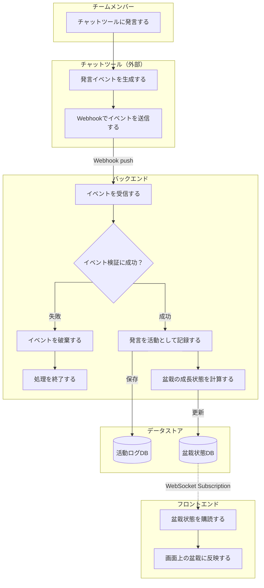

# 要件定義

## 背景・目的

リモートワークでは、雑談やちょっとした相談が起きにくく、チームメンバーの作業状況や気付きが見えにくくなりがちである。

その問題を補う取り組みとして、個人の作業内容や気付き、ちょっとした雑談を社内のチャットツールにリアルタイムで投稿し、チーム内で共有する**分報**という文化がある。

ただ、忙しいと投稿を後回しにしてしまったり、何を書くか考えているうちにタイミングを逃してしまったりすることがある。結果として、分報は有用だと分かっていても、継続するには心理的なハードルが残る。

そこで、自分のチャットツールでの発言を元に**盆栽**を育て、それをチームメンバー間で共有することで、日々の発信をゆるやかに可視化する。

盆栽には、**ゆっくり育てること**や**日々の積み重ねが見える**ことといったメタファーがある。

発言量を競わせるのではなく、日々の小さな発信が盆栽の成長として見えることで、分報を書くきっかけを生み、チーム内の状況共有や雑談・相談の心理的ハードルを下げることを目的とする。

## 対象ユーザー

分報や日々の状況共有を行っている、または促進したいチームのメンバー

初期対応は**Slack**を利用しているチームを対象とし、将来的に対応チャットツールを拡張する。

## ワークフロー

