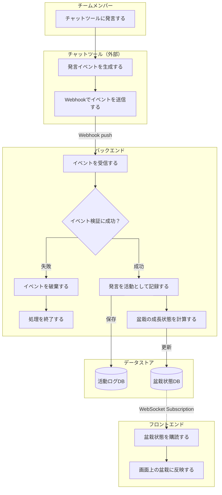

# 要件定義

## 背景・目的

リモートワークでは、雑談やちょっとした相談が起きにくく、チームメンバーの作業状況や気付きが見えにくくなりがちである。

その問題を補う取り組みとして、個人の作業内容や気付き、ちょっとした雑談を社内のチャットツールにリアルタイムで投稿し、チーム内で共有する**分報**という文化がある。

ただ、忙しいと投稿を後回しにしてしまったり、何を書くか考えているうちにタイミングを逃してしまったりすることがある。結果として、分報は有用だと分かっていても、継続するには心理的なハードルが残る。

そこで、自分のチャットツールでの発言を元に**盆栽**を育て、それをチームメンバー間で共有することで、日々の発信をゆるやかに可視化する。

盆栽には、**ゆっくり育てること**や**日々の積み重ねが見える**ことといったメタファーがある。

発言量を競わせるのではなく、日々の小さな発信が盆栽の成長として見えることで、分報を書くきっかけを生み、チーム内の状況共有や雑談・相談の心理的ハードルを下げることを目的とする。

## 対象ユーザー

分報や日々の状況共有を行っている、または促進したいチームのメンバー

初期対応は**Slack**を利用しているチームを対象とし、将来的に対応チャットツールを拡張する。

## ワークフロー

## スコープ

### 作る範囲

- Slackの発言イベントを受け取る (特定のテナントではなく、どのテナントからも受け入れ可能にする)
- 初期対応チャットツールはSlackのみとする
- イベントの正当性を検証する
- 対象ユーザー・チームを識別する
- 発言を活動ログとして保存する
- 活動量を元に盆栽の成長状態を更新する
- フロントエンドで自分の盆栽を表示する
- フロントエンドでチームメンバーの盆栽一覧を表示する
- WebSocket購読で盆栽状態の更新を画面に反映する

### 作らない範囲

- Slack以外のチャットツール連携
- 投稿内容の高度な自然言語解析
- 発言ランキングや競争を強める機能
- 分報の投稿代行や自動投稿機能
- 投稿を促すリマインド通知
- ユーザーによる盆栽の手動カスタマイズ
- 管理者向けの詳細な設定画面
- モバイルアプリ
- 複雑な3D表現や専用アセット管理

### 将来的に検討する範囲

- 対応チャットツールの拡張
- リアクションやスタンプを成長条件に含める
- 感謝表現など特定キーワードの検出
- チームごとの成長ルール設定
- 活動統計やグラフ表示
- 通知機能
- 盆栽のテーマ変更や装飾

## ユーザーストーリー

- チームメンバーとして、普段のチャットでの発言を自分の盆栽の成長として見たい。
- チームメンバーとして、他のメンバーの盆栽を見て、チーム内の発信状況をゆるやかに知りたい。

## 機能要件

### Slack連携

- Slackの発言イベントを受信できること。
- 受信したイベントの正当性を検証できること。
- 発言したユーザーと所属チームを識別できること。

### 活動記録

- 有効な発言イベントを活動ログとして保存できること。
- 同一イベントを重複して記録しないこと。

### 盆栽成長

- ユーザーごとの活動量を元に、盆栽の成長状態を更新できること。
- 盆栽の成長状態をユーザー単位で保存できること。

### 盆栽表示

- ユーザーは自分の盆栽を表示できること。
- ユーザーは同じチームに所属するメンバーの盆栽一覧を表示できること。

### リアルタイム反映

- 盆栽状態が更新された場合、WebSocket購読によってフロントエンドに自動で反映できること。
