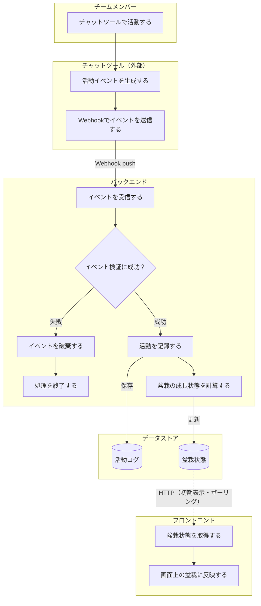
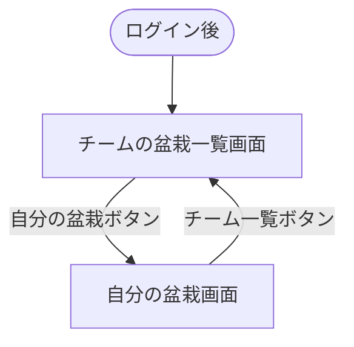

# 要件定義

> たま森が「何を満たすべきか」を定義する。Slack 上のチーム活動を盆栽として可視化し、分報を書くきっかけとチーム内の状況共有を促すサービスの要件をまとめる。技術的な実現方法は [architecture.md](architecture.md)、データ構造は [db.md](db.md) を正とする。用語は [glossary.md](glossary.md) を参照。

## 本書の規範キーワード

要件の強さは以下のキーワードで示す（[RFC 2119](https://datatracker.ietf.org/doc/html/rfc2119) に準拠）。

| キーワード | 意味 |
| --- | --- |
| **必須（MUST）** | MVP で必ず満たす。満たさなければ要件未達。 |
| **推奨（SHOULD）** | 原則満たす。外す場合は明確な理由が必要。 |
| **任意（MAY）** | 満たしてもよい。将来検討を含む。 |

## 1. 背景・目的

リモートワークでは、雑談やちょっとした相談が起きにくく、チームメンバーの作業状況や気付きが見えにくくなりがちである。

その問題を補う取り組みとして、個人の作業内容や気付き、ちょっとした雑談を社内のチャットツールにリアルタイムで投稿し、チーム内で共有する**分報**という文化がある。ただ、忙しいと投稿を後回しにしたり、何を書くか迷ってタイミングを逃したりして、継続には心理的なハードルが残る。

そこで、自分のチャットでの発言を元に**盆栽**を育て、チームで共有することで、日々の発信をゆるやかに可視化する。盆栽には「ゆっくり育てる」「日々の積み重ねが見える」というメタファーがある。

発言量を競わせるのではなく、日々の小さな発信が盆栽の成長として見えることで、分報を書くきっかけを生み、状況共有や雑談・相談の心理的ハードルを下げることを目的とする。

## 2. 対象ユーザー

- 分報や日々の状況共有を行っている、または促進したいチームのメンバー。
- 初期対応は **Slack** を利用しているチームを対象とし、将来的に対応チャットツールを拡張する。

## 3. ワークフロー

## 4. スコープ

### 作る範囲

- 任意の Slack ワークスペースがアプリを**インストール**して利用を開始できる（マルチテナント）。
- 利用者は **Sign in with Slack** でログインする。
- Slack の発言・リアクションイベントを受け取る（特定テナントに限らず、どのテナントからも受け入れる）。
- イベントの正当性を検証する。
- 対象ユーザー・チームを識別する。
- 発言・リアクション・感謝を活動ログとして保存する。
- 活動量を元に盆栽の成長状態を更新する。
- 自分の盆栽・チームメンバーの盆栽一覧を表示する。
- ポーリングで盆栽状態の更新を画面へ反映する。

### 作らない範囲

- Slack 以外のチャットツール連携／投稿内容の高度な自然言語解析
- 発言ランキングや競争を強める機能／投稿の代行・自動投稿・リマインド通知
- ユーザーによる盆栽の手動カスタマイズ／管理者向けの詳細設定画面
- モバイルアプリ／複雑な 3D 表現や専用アセット管理

### 将来的に検討する範囲

- 対応チャットツールの拡張／チームごとの成長ルール設定
- 活動統計やグラフ表示／通知機能／盆栽のテーマ変更・装飾
- 大規模チーム対応（多人数の一覧仮想化・ページング等）／Slack Enterprise Grid の org-wide install

## 5. ユーザーストーリー

- チームメンバーとして、普段のチャットでの発言を自分の盆栽の成長として見たい。
- チームメンバーとして、他のメンバーの盆栽を見て、チーム内の発信状況をゆるやかに知りたい。

## 6. 機能要件

用語（活動量 / 成長段階 / 活力 / 季節 など）は [glossary.md](glossary.md) を参照。

### 6.1 Slack 連携

| 要件 | 区分 |
| --- | --- |
| Slack の発言・リアクションイベントを受信できる | 必須（MUST） |
| 受信したイベントの正当性（署名）を検証できる | 必須（MUST） |
| 活動したユーザーと所属チームを識別できる | 必須（MUST） |

### 6.2 活動記録

| 要件 | 区分 |
| --- | --- |
| 有効な Slack イベントを活動ログとして保存できる | 必須（MUST） |
| 同一イベントを重複して記録しない | 必須（MUST） |
| 発言内容から感謝表現を検出し、感謝として扱える | 必須（MUST） |

### 6.3 盆栽成長

| 要件 | 区分 |
| --- | --- |
| 発言数・リアクション数・感謝数を元に活動量を算出できる | 必須（MUST） |
| 活動量を元に成長段階を更新できる。成長は単調・不可逆で、後退（枯死・劣化）しない | 必須（MUST） |
| 成長を「成長フェーズ」と「維持・循環フェーズ」の 2 フェーズで扱える | 必須（MUST） |
| 生の活動数値で競争を煽らず、盆栽の姿と成長段階で穏やかに表現する | 推奨（SHOULD） |

### 6.4 季節と活力

| 要件 | 区分 |
| --- | --- |
| 盆栽と周囲の環境が現実の季節（四季）に応じて変化する | 必須（MUST） |
| 日々の活動に応じて季節に合った活力表現が加点的に現れる。非活動でも枯れず穏やかに保つ（マイナス要因を持たない） | 必須（MUST） |

成長段階・季節・活力の見た目の正は [visual.md](visual.md) に従う。

### 6.5 盆栽表示

| 要件 | 区分 |
| --- | --- |
| ユーザーは自分の盆栽を表示できる | 必須（MUST） |
| ユーザーは同じチームのメンバーの盆栽一覧を表示できる | 必須（MUST） |

### 6.6 更新の反映

| 要件 | 区分 |
| --- | --- |
| 盆栽状態の更新をポーリング（定期取得）でフロントエンドに反映できる | 必須（MUST） |

### 6.7 認証・導入

| 要件 | 区分 |
| --- | --- |
| 任意のワークスペースがアプリをインストールして接続できる（マルチテナント） | 必須（MUST） |
| 利用者は Sign in with Slack でログインできる | 必須（MUST） |
| 利用できるのはアプリをインストール済みのワークスペースのメンバーのみ（install ゲーティング） | 必須（MUST） |
| 他チームのデータを取得・表示できない（テナント分離） | 必須（MUST） |
| ログアウト・利用者無効化・テナント退会でセッションを即時失効できる | 推奨（SHOULD） |
| アンインストール時にトークン/セッションを即時破棄し、育成データは猶予期間後に削除する（再インストールで復元可） | 推奨（SHOULD） |

認証・認可の設計は [architecture.md](architecture.md) §9、エンドポイントは [api.md](api.md) を参照。

## 7. 画面・操作

### 7.1 自分の盆栽画面

自分の盆栽の成長状態を確認できる。

- 主な表示: 自分の盆栽（3D）と現在の成長段階／やわらかな進捗表現（生の活動数値は出さない）／季節に応じた変化と活力の反映。
- 主な操作: 成長状態を確認する／チームの盆栽一覧画面へ移動する。

### 7.2 チームの盆栽一覧画面

同じチームに所属するメンバーの盆栽を一覧で確認できる。

- 主な表示: メンバーごとの盆栽（盆栽棚に並ぶ）／表示名／成長段階。
- 主な操作: 一覧を確認する／メンバーの盆栽を選び個別画面へ移動する／自分の盆栽画面へ移動する。

レイアウト・見た目は [visual.md](visual.md) に従う。

### 7.3 画面遷移

## 8. 扱うデータ

保持するのは、チーム・ユーザー・活動ログ・盆栽状態の 4 エンティティである。**属性・型・制約の詳細は [db.md](db.md) を正とする**（本書では概要のみ示す）。

| エンティティ | 役割 |
| --- | --- |
| チーム | Slack ワークスペースを識別し、テナント分離の単位とする。 |
| ユーザー | チーム内のメンバーを識別し、盆栽状態と紐づける。 |
| 活動ログ | 発言・リアクション・感謝の記録。重複処理の防止にも使う。 |
| 盆栽状態 | ユーザーごとの現在の盆栽状態（活動量・成長段階・最終活動時刻など）。 |

### 保存しないデータ（要件）

投稿本文や会話履歴などの内容そのものは**保存してはならない（MUST NOT）**。活動種別の判定や感謝表現の検出にのみ使用する。対象は投稿本文・会話履歴・添付ファイル・リンク先の内容・リアクション対象の投稿本文。実装上の扱いは [db.md](db.md) §5 を参照。

## 9. 外部連携（Slack）

- Slack Events API の **HTTP Request URL** で活動イベントを受信する。
- 受信対象: メッセージ投稿イベント、リアクション追加イベント。
- Slack リクエストは署名検証を**行わなければならない（MUST）**。
- Slack チーム・ユーザーを識別し、同一イベントの重複処理を防ぐ。
- 受信したイベントは、チャットツールに依存しない内部の活動イベント（発言 / リアクション / 感謝）へ変換して扱う。Slack 固有の形式のまま保存しない。

活動種別の定義は [glossary.md](glossary.md) §5、変換・処理の詳細は [architecture.md](architecture.md) §4・[api.md](api.md) を参照。Slack アプリのインストール・スコープ・購読イベントは [api.md](api.md)「Slack アプリ設定」を正とする。

## 10. 非機能要件

| 分類 | 要件 | 区分 |
| --- | --- | --- |
| セキュリティ | Slack Webhook は署名検証を行う | 必須（MUST） |
| セキュリティ | チームごとのデータが他チームに見えないようにする（テナント分離） | 必須（MUST） |
| セキュリティ | 投稿本文は保存しない／秘密情報は環境変数で管理する | 必須（MUST） |
| 可用性 | Slack Events API へ短時間で応答する | 必須（MUST） |
| 可用性 | Slack イベントの再送に備え、同一イベントを重複処理しない | 必須（MUST） |
| 可用性 | 一時的な取得失敗はポーリングの次回取得で回復できる | 推奨（SHOULD） |
| 性能 | 各画面は初期表示時に必要な盆栽状態を取得できる | 必須（MUST） |
| 性能 | Slack イベント受信処理は Webhook 応答を遅らせない | 必須（MUST） |
| 保守性 | Slack 固有形式は内部の活動イベントへ変換して扱う | 必須（MUST） |
| 保守性 | 盆栽の成長計算を Slack 連携処理から分離する | 推奨（SHOULD） |
| 保守性 | 将来的にチャットツールを追加できるようにする | 任意（MAY） |
| 運用性 | Webhook 受信・イベント処理の主要箇所にログを残し、障害時に原因を追える | 推奨（SHOULD） |
| アクセシビリティ | サービス UI は WCAG 2.2 AA を満たす（本文コントラスト 4.5:1、フォーカス可視、`prefers-reduced-motion` 尊重）。トークンは [design-tokens.md](design-tokens.md) が正 | 推奨（SHOULD） |

## 11. 制約条件

技術選定の詳細と理由は [architecture.md](architecture.md) を正とする。要件として固定する制約は以下。

- 初期対応チャットツールは Slack のみとする。
- フロントエンドとバックエンドは分離して構築する。バックエンドは BFF ではなく独立した API サーバーとする。
- フロントエンドは Vercel、バックエンドは Cloud Run にデプロイする。
- web / api は共通の登録可能ドメイン配下のカスタムドメインで公開する（Cookie セッション成立の前提。[architecture.md](architecture.md) §9）。
- DB には PostgreSQL を採用する。DB へアクセスするのはバックエンドのみとする。
- 投稿本文や会話履歴は保存しない。Slack イベントは内部の活動イベントへ変換して扱う。

## 12. 優先順位

1. Slack 上の活動を安全に受け取り、活動ログとして記録できること。
2. 活動量を元に盆栽状態を更新できること。
3. 自分とチームメンバーの盆栽を表示できること。
4. 盆栽状態の更新をフロントエンドへ反映できること。

## 関連リンク

- [architecture.md](architecture.md) — アーキテクチャ・技術スタック・データフロー
- [api.md](api.md) — API 仕様
- [db.md](db.md) — データ構造の正
- [visual.md](visual.md) — 盆栽の見た目の正
- [glossary.md](glossary.md) — 用語集
