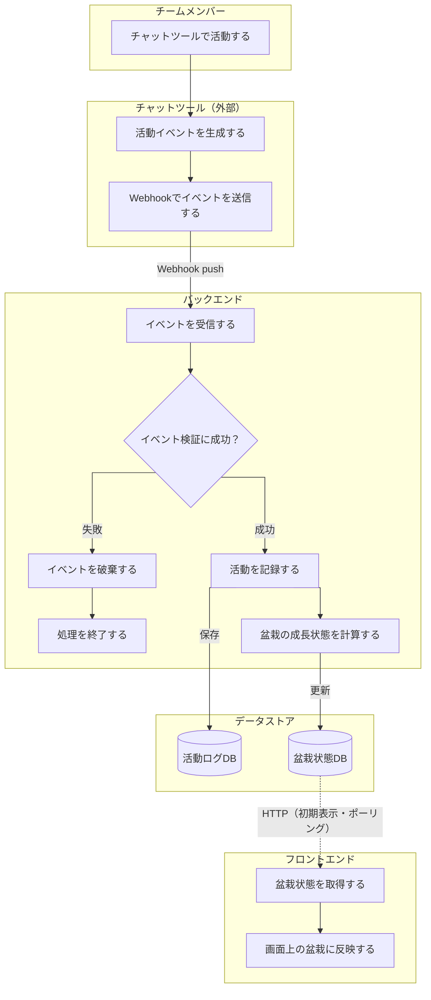
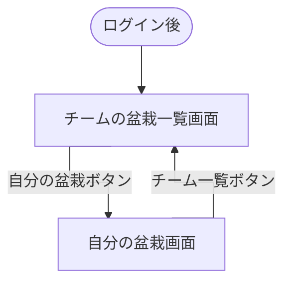

# 要件定義

## 1. 背景・目的

リモートワークでは、雑談やちょっとした相談が起きにくく、チームメンバーの作業状況や気付きが見えにくくなりがちである。

その問題を補う取り組みとして、個人の作業内容や気付き、ちょっとした雑談を社内のチャットツールにリアルタイムで投稿し、チーム内で共有する**分報**という文化がある。

ただ、忙しいと投稿を後回しにしてしまったり、何を書くか考えているうちにタイミングを逃してしまったりすることがある。結果として、分報は有用だと分かっていても、継続するには心理的なハードルが残る。

そこで、自分のチャットツールでの発言を元に**盆栽**を育て、それをチームメンバー間で共有することで、日々の発信をゆるやかに可視化する。

盆栽には、**ゆっくり育てること**や**日々の積み重ねが見える**ことといったメタファーがある。

発言量を競わせるのではなく、日々の小さな発信が盆栽の成長として見えることで、分報を書くきっかけを生み、チーム内の状況共有や雑談・相談の心理的ハードルを下げることを目的とする。

## 2. 対象ユーザー

分報や日々の状況共有を行っている、または促進したいチームのメンバー

初期対応は**Slack**を利用しているチームを対象とし、将来的に対応チャットツールを拡張する。

## 3. ワークフロー

## 4. スコープ

### 作る範囲

- Slackの発言・リアクションイベントを受け取る（特定のテナントではなく、どのテナントからも受け入れ可能にする）。
- 初期対応チャットツールはSlackのみとする。
- イベントの正当性を検証する。
- 対象ユーザー・チームを識別する。
- 発言・リアクション・感謝を活動ログとして保存する。
- 活動量を元に盆栽の成長状態を更新する。
- フロントエンドで自分の盆栽を表示する。
- フロントエンドでチームメンバーの盆栽一覧を表示する。
- ポーリングで盆栽状態の更新を画面に反映する。

### 作らない範囲

- Slack以外のチャットツール連携
- 投稿内容の高度な自然言語解析
- 発言ランキングや競争を強める機能
- 分報の投稿代行や自動投稿機能
- 投稿を促すリマインド通知
- ユーザーによる盆栽の手動カスタマイズ
- 管理者向けの詳細な設定画面
- モバイルアプリ
- 複雑な3D表現や専用アセット管理

### 将来的に検討する範囲

- 対応チャットツールの拡張
- チームごとの成長ルール設定
- 活動統計やグラフ表示
- 通知機能
- 盆栽のテーマ変更や装飾

## 5. ユーザーストーリー

- チームメンバーとして、普段のチャットでの発言を自分の盆栽の成長として見たい。
- チームメンバーとして、他のメンバーの盆栽を見て、チーム内の発信状況をゆるやかに知りたい。

## 6. 機能要件

### Slack連携

- Slackの発言・リアクションイベントを受信できること。
- 受信したイベントの正当性を検証できること。
- 活動したユーザーと所属チームを識別できること。

### 活動記録

- 有効なSlackイベントを活動ログとして保存できること。
- 同一イベントを重複して記録しないこと。
- 発言内容から感謝表現を検出し、感謝数として扱えること。

### 盆栽成長

- 発言数・リアクション数・感謝数を元に、活動量を算出できること。
- 算出した活動量を元に、盆栽の成長段階を更新できること。成長は単調・不可逆で、後退（枯死・劣化）はしないこと。
- 盆栽の成長は「成長フェーズ（段階的に育つ）」と「維持・循環フェーズ（到達後も季節と活力で生き続ける）」の2フェーズで扱えること。
- 各活動数はユーザー単位で保存するが、画面では生の数値で競争を煽らず、盆栽の姿と成長段階で穏やかに表現すること。

### 季節と活力

- 盆栽および周囲の環境は、現実の季節に応じて見た目が変化すること（四季）。
- 日々の活動に応じて、その季節に合った「活力」表現（例: 春の開花）が加点的に現れること。非活動でも枯れず穏やかに保たれること（マイナス要因を持たない）。
- 成長段階・季節・活力の見た目の正は [visual-design.md](visual-design.md) に従う。

### 盆栽表示

- ユーザーは自分の盆栽を表示できること。
- ユーザーは同じチームに所属するメンバーの盆栽一覧を表示できること。

### 更新の反映

- 盆栽状態が更新された場合、ポーリング（定期取得）によってフロントエンドに反映できること。

## 7. 画面・操作

### 自分の盆栽画面

ユーザーは、自分の盆栽の成長状態を確認できる。

主な表示内容:

- 自分の盆栽（3D）と現在の成長段階
- やわらかな進捗表現（生の活動数値は出さない）
- 季節に応じた盆栽・風景の変化、活動による活力の反映

詳細な見た目は [visual-design.md](visual-design.md) に従う。

主な操作:

- 盆栽の成長状態を確認する
- チームの盆栽一覧画面へ移動する

### チームの盆栽一覧画面

ユーザーは、同じチームに所属するメンバーの盆栽を一覧で確認できる。

主な表示内容:

- チームメンバーごとの盆栽（盆栽棚に並ぶ）
- 各メンバーの表示名
- 各メンバーの成長段階

レイアウト・見た目は [visual-design.md](visual-design.md) に従う。

主な操作:

- チームメンバーの盆栽一覧を確認する
- メンバーの盆栽を選び、その個別画面へ移動する
- 自分の盆栽画面へ移動する

### 画面遷移

## 8. 扱うデータ

### チーム

Slack上のチームを識別する。

- **チームID (PK)**
- SlackチームID
- チーム名
- createdAt / updatedAt

### ユーザー

チーム内のメンバーを識別し、盆栽と紐づける。

- **ユーザーID (PK)**
- **チームID (FK)**
- SlackユーザーID
- 表示名
- アイコン画像URL
- createdAt / updatedAt

### 活動ログ

Slack上で活動があったことを記録し、重複処理を防ぐ。

- **活動ログID (PK)**
- **チームID (FK)**
- **ユーザーID (FK)**
- SlackイベントID
- 活動種別 (発言 / リアクション / 感謝)
- 活動日時
- createdAt / updatedAt

### 盆栽状態

ユーザーごとの盆栽の成長状態を表示・更新する。

- **盆栽状態ID**
- **チームID (FK)**
- **ユーザーID (FK)**
- 発言数
- リアクション数
- 感謝数
- 活動量
- 成長段階
- createdAt / updatedAt

活動量は、発言数・リアクション数・感謝数を元に算出する。
成長段階は、算出した活動量を元に決定する。

### 保存しないデータ

Slack上の会話内容そのものは保存しない。
必要な場合でも、活動種別の判定や感謝表現の検出にのみ使用する。

- 投稿本文
- チャンネル内の会話履歴
- 添付ファイル
- リンク先の内容
- リアクション対象の投稿本文

## 9. アーキテクチャ

### モノレポ構成

#### apps/web (フロントエンド)

自分の盆栽画面とチームの盆栽一覧画面を表示。

#### apps/api (バックエンド)

MVPでは、HTTP API、Slack Webhook受信、盆栽状態更新を担当する。

- 初期表示

HTTP APIで現在の自分 / チームの盆栽状態を返す。

- 更新

SlackからのWebhookを受け取り、内部の活動イベントへ変換した上で、活動ログ・盆栽状態をDBに保存する。

1. WebhookでSlackイベントを受け取る。
2. Slackイベントを内部の活動イベントへ変換する。
3. 活動イベントを活動ログとしてDBに保存する。
4. 活動ログを元に、盆栽状態を計算してDBに保存する。

apps/api は push 配信を行わず、apps/web が一定間隔のポーリングで最新の自分 / チームの盆栽状態を取得して反映する。

将来的にチャットツール連携やイベント処理が複雑になった場合、Webhook受信・イベント変換・盆栽状態計算を別のパッケージまたは別アプリとして切り出す。

## 10. 外部連携

### Slack (チャットツール)

Slack Events APIの**HTTP Request URL**で、Slack上の活動イベントを受信する。

#### 主な用途

- メッセージ投稿イベントの受信
- リアクション追加イベントの受信
- Slackリクエストの署名検証
- Slackチーム・Slackユーザーの識別
- Slackイベントの重複処理防止

#### 主な活動種別

- **発言**
- **リアクション**
- **感謝 (発言内容から感謝表現を検出)**

Slackから受け取ったイベントは、サービス内部ではチャットツールに依存しない活動イベントへ変換する。
Slack固有のイベント形式は、そのまま活動ログとして保存しない。

### デプロイ先

- フロントエンドとバックエンドは分離してデプロイする。
- apps/webはVercel、apps/apiはCloud Runを利用する。
- apps/apiはコンテナとして管理する。

### apps/web

- デプロイ先: Vercel
- 対象: Reactフロントエンド
- 採用理由: フロントエンドの開発体験とデプロイの容易さを優先する

### apps/api

- デプロイ先: Cloud Run
- 対象: Hono + Slack Boltを用いたバックエンドコンテナ
- 採用理由: HTTP API・Slack Events API を1つのNode.jsバックエンドで扱いやすい
- Slack Boltの扱い: Slackイベントの受信・検証・ハンドリングを行う部品として利用する
- 注意点: Webhook受信時の速やかな応答を考慮する（更新の反映は apps/web のポーリングで行うため push 配信・複数インスタンス間の状態同期は不要）

## 11. 非機能要件

### セキュリティ

- SlackからのWebhookは署名検証を行う。
- チームごとのデータが他チームに見えないようにする。
- 投稿本文は保存しない。
- 秘密情報は環境変数で管理する。

### 可用性

- Slack Events APIには短時間で応答する。
- Slackイベントの再送に備えて、同一イベントを重複処理しない。
- ポーリングは一定間隔で最新状態を取得するため、一時的な取得失敗は次回取得で回復できる。

### 性能

- 自分の盆栽画面とチームの盆栽一覧画面は、初期表示時に必要な盆栽状態を取得できる。
- Slackイベント受信時の処理は、Webhook応答を遅らせない。

### 保守性

- Slack固有のイベント形式は、内部の活動イベントへ変換して扱う。
- 盆栽の成長計算は、Slack連携処理から分離する。
- 将来的にチャットツールを追加できるようにする。

### 運用性

- Webhook受信、イベント処理でエラーを記録できる。
- 障害時に原因を追えるよう、主要な処理にログを残す。

## 12. 制約条件

- 初期対応チャットツールはSlackのみとする。
- フロントエンドとバックエンドは分離して構築する。
- バックエンドはBFFではなく、独立したAPIサーバーとして構築する。
- apps/webはVercelにデプロイする。
- apps/apiはCloud Runにデプロイする。
- DBにはPostgreSQLを採用する。
- 投稿本文や会話履歴は保存しない。
- Slackイベントは内部の活動イベントへ変換して扱う。

## 13. 優先順位

1. Slack上の活動を安全に受け取り、活動ログとして記録できること。
2. 活動量を元に盆栽状態を更新できること。
3. 自分とチームメンバーの盆栽を表示できること。
4. 盆栽状態の更新をフロントエンドへ反映できること。
