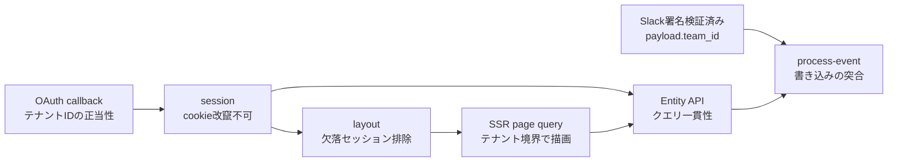

# Issue #74 コンポーネント責務マップ

認証・認可チェーンを構成する 6 コンポーネントの**契約**（何を保証し、何を信頼し、次に何を渡すか）を明文化する。

レビューの読み方:

- 「保証」は **このコンポーネントを通過したら成立している不変条件**。
- 「信頼」は **自分では検証せず、上流に依拠している前提**。ここが崩れればこのコンポーネントの保証も崩れる。
- 「破れた場合」を追うと **どのコンポーネントの責務漏れが、どの攻撃面に直結するか** が見える。

---

## チェーン全体像（責務のバトン）

認可の**読み取り経路**は `OAuth callback → session → layout → page → Entity API`、**書き込み経路**は `Slack署名 → process-event → Entity API` の 2 系統が独立している点に注意。

---

## 1. OAuth callback

`src/app/api/auth/slack/callback/route.ts`

### 保証すること

- セッションに書き込まれる `slackTeamId` は、**今まさに OAuth を完了したユーザーが実在する Slack ワークスペースのID** である。
- セッションが発行されるのは、正しい CSRF state を提示し、Slack から有効な access_token を得たユーザーのみ。
- `users` テーブルに `(slack_user_id, slack_team_id)` の整合行が存在する（upsert 済み）。

### 信頼している入力

- `fetchUserIdentity(token)` が返す `teamId` が、その access_token に紐づく**真のワークスペースID**（= Slack API を真実源として信頼）。
- `session.oauthState` は iron-session により改竄されていない。
- HTTPS 経路で `code` / `state` が盗聴されていない。

### 次の層に渡す保証

- cookie に積まれる `session.slackTeamId` は、以降の全層が **検証なしで信じてよい値**。
- `session.userId` は `users.id` に実在する UUID で、同じセッションの `slackTeamId` と DB 上整合する。

### 破れた場合

- **偽の teamId** がセッションに入ると、以降の全認可判定（layout・page・SWR・process-event）が**同時に破綻**する。下流はこの値を信じているだけで検証していないため。
- 具体的には：他テナントの `/garden` が全件見える、任意 userId で `/bonsai/[userId]` が見える、書き込み時のテナント突合が無意味になる。
- **このコンポーネントは認可チェーン全体の Root of Trust**。ここが壊れると下流の多層防御は意味をなさない。

---

## 2. session

`src/features/slack-auth/model/session.ts`

### 保証すること

- cookie の中身は `SESSION_SECRET` で署名・暗号化されており、**クライアント側での改竄は不可能**。
- `SessionData` の型で形状を保証（`slackTeamId: string` が必ず存在）。
- Server Component 経路 (`getServerSession`) は `ReadonlySession` 型で返し、**型レベルで書き込みを禁止**。書き込みは Route Handler 経路 (`getSession`) のみ。

### 信頼している入力

- `SESSION_SECRET` が十分な長さ（32 文字以上）で秘密裏に管理されていること。
- TTL（7日間）内の cookie であること — 期限切れは iron-session が弾く。
- OAuth callback が `slackTeamId` を正しく書き込んでくれること（= session 自身は中身の意味論を検証しない）。

### 次の層に渡す保証

- cookie 経由で受け取った `SessionData` は**改竄されていない状態でそのまま戻ってくる**。
- 書き込まれた `slackTeamId` は、その後読み出す全ての層で同じ値として読める。
- `getServerSession` の戻り値に対して `save()` を呼ぶと型エラー — Server Component 側の誤使用を防ぐ。

### 破れた場合

- `SESSION_SECRET` が漏洩 → 任意の teamId / userId を持つ cookie を攻撃者が自作可能 → **完全ななりすまし**。
- `ReadonlySession` が無視されて Server Component から書き込まれると、React のレンダリングフェーズで cookie を書こうとして Next.js が例外を出す（運用時の不可解なバグ）。
- TTL 設定が長すぎると、退職者の cookie が生き続ける。

---

## 3. layout

`src/app/(pages)/layout.tsx`

### 保証すること

- `(pages)` グループ配下の**全ページに到達する時点**で、`session.userId` と `session.slackTeamId` の**両方が空文字でない**。
- 旧セッション cookie（Issue #74 以前に発行された `slackTeamId` 未設定の cookie）を持つユーザーを `/` に追い返し、再ログインへ誘導する。

### 信頼している入力

- `session.ts` が返すセッションが改竄されていない（= session の保証に依拠）。
- OAuth callback が `userId` と `slackTeamId` を**揃えて**書き込む（片方だけ書かれる分岐は存在しない）。

### 次の層に渡す保証

- 下位の `page.tsx` / Client Component は `session.slackTeamId === ''` ケースを**考慮する必要がない**。
- つまり `getServerSession()` から得た `slackTeamId` を**そのままクエリ条件に渡して OK**（空文字でクエリすると全件が漏れる事故を防ぐ）。

### 破れた場合

- 空の `slackTeamId` が page.tsx に到達 → Supabase クエリで `.eq('users.slack_team_id', '')` となる。
- 現行スキーマでは `users.slack_team_id` は `NOT NULL` だが空文字を許容するので、将来「空文字 team_id のユーザー」が紛れ込むと**全テナント横断の情報漏洩**に直結しうる。
- **layout は page 側に「非空 slackTeamId」という事前条件を与えるゲート**。これを page 側が追加で検証していない設計なので、layout の責務漏れはそのまま脆弱性。

---

## 4. SSR page query

`src/app/(pages)/garden/page.tsx`、`src/app/(pages)/bonsai/[userId]/page.tsx`

### 保証すること

- SSR 初回描画に使われる `data` は、**現在セッションの `slackTeamId` に所属する行のみ**。
- SWRConfig の `fallback` に注入されるデータも同じ絞り込みが適用済み（= Client 側の SWR 初期キャッシュも安全）。
- `/bonsai/[userId]` で他テナントの userId を指定した場合、存在情報を漏らさず `notFound()` で 404 を返す。
- Client Component に prop として渡す `slackTeamId` は、認証済みセッションから取得した**検証済みの値**。

### 信頼している入力

- `getServerSession()` が返す `slackTeamId` が**非空**かつ**正当な値**（layout + session + callback の連鎖に依拠）。
- Supabase PostgREST の `users!inner(...)` JOIN + embedded-filter (`users.slack_team_id`) が期待通り動く。
- `users.slack_team_id` カラムが OAuth 時点の正確な値で保存されている。

### 次の層に渡す保証

- Client Component (`GardenContent` / `BonsaiPageContent`) が受け取る初期データ・`slackTeamId` prop は**テナント境界内**。
- Client 側 SWR フックは、prop で受けた `slackTeamId` を**そのまま再クエリに使って OK**。

### 破れた場合

- **典型的な IDOR**: `/bonsai/[他テナントuserId]` で他人の盆栽が表示される。
- `/garden` が全テナント横断の一覧になる（**今回の Issue の最大の攻撃面**）。
- SWR fallback 経由で、Client 側のキャッシュに他テナント情報が流入。以降 SWR が再 fetch する前のレンダリングで他テナントが見える。
- `notFound()` 漏れ → レスポンスの有無や描画内容から**存在情報が漏れる**（存在する userId は空ページ、存在しない userId はエラー、など挙動が分かれるとオラクルになる）。

---

## 5. Entity API

`src/entities/bonsai/api/bonsai-api.ts`、`src/entities/bonsai/api/bonsai-swr.ts`

### 保証すること

- `getBonsaiByUserId(userId, slackTeamId)` / `useBonsai(userId, slackTeamId)` / `useAllBonsai(slackTeamId)` は、**引数 `slackTeamId` に合致するテナントの行しか返さない**。
- SSR・CSR SWR・サーバ内部呼び出し（callback、process-event）の**全経路で同じクエリ構造** (`users!inner` + embedded-filter) を使う — クエリの書き方揺れを一点に集約する FSD 上の責務。

### 信頼している入力

- 呼び出し側が**正しい `slackTeamId` を渡す**こと（= ここは自ら検証しない）。
- Supabase の `!inner` JOIN が inner join として解釈され、`users` 側のフィルタ不一致で bonsai 行も除外されること（PostgREST 仕様）。
- `users.slack_team_id` の整合性（upsert 時点で正しく入っている）。

### 次の層に渡す保証

- 戻り値の `data` は必ずテナント境界内。呼び出し側は追加の絞り込みを書かなくてよい。
- 他テナント指定や実在しない `userId` の場合、`single()` が `PGRST116` (行なし) を返す — 呼び出し側はこれで「未存在 or 越境」を判定できる（callback 側の新規盆栽作成ロジックが依拠）。

### 破れた場合

- **全呼び出し元が一斉に壊れる** — callback・SSR page・SWR・process-event が全部このレイヤーを経由するため、爆心地になりやすい。
- クエリ構造の揺れ（ある箇所だけ `!inner` を外す、ある箇所だけフィルタを忘れる）が発生すると、**片経路だけ越境可能**という見つけにくいバグを生む。
- 注意: `createBonsai` / `updateBonsai` は `slackTeamId` 引数を取らない。これらは ID 直接操作のため、**呼び出し側が先に `getBonsaiByUserId` で検証された ID を渡すことに依拠**している。この契約が崩れると、ID を知っているだけで他テナント盆栽を更新できる。

---

## 6. process-event

`src/features/bonsai-growth/api/process-event.ts`

### 保証すること

- DB への書き込み（`action_log` INSERT・`bonsai` UPDATE）は、Slack payload の `team_id` と `users.slack_team_id` が**一致する場合のみ**実行される。
- 別ワークスペースの Slack イベントが他テナントの盆栽/ログを**汚染しない**。
- 冪等性: 同じ `event_id` は二重処理されない（`checkEventExists`）。

### 信頼している入力

- **このフローはユーザーセッションを経由しない** — 信頼の根拠はセッション cookie ではなく以下:
    - 上流（`/api/slack/events` route）で**HMAC-SHA256 署名検証済み**の payload であること。
    - `payload.team_id` はイベントを発生させた**真のワークスペースID**（Slack を真実源として信頼）。
    - `getUserBySlackId(event.user)` が返す user の `slack_team_id` が正確。
- `getBonsaiByUserId(user.id, user.slack_team_id)` が Entity API の契約を満たすこと。

### 次の層に渡す保証

- Supabase への書き込みは全てテナント境界内。
- Realtime で購読者にブロードキャストされる UPDATE も、汚染されていない正当なテナントの更新。

### 破れた場合

- **書き込み系の越境汚染**: 別ワークスペースの Slack メッセージで他人の盆栽が勝手に成長する、action_log に他テナントのログが混ざる。
- 統計 (`/stats`) が狂う。Realtime 経由でダッシュボードに偽の更新が流れる。
- **セッション認可とは独立した攻撃面**: 読み取り側 (page / SWR) をいくら固めても、ここが漏れると書き込み経路から汚染が入り、結果として読み取り側に（正当なテナント所属の）汚染データが見える。

### 特殊性

- このコンポーネントは **「Slack 署名 + payload.team_id 信頼 + DB 側 slack_team_id 突合」** という、セッションベースの認可と完全に独立した別系統の防御ライン。
- 読み取り経路が `OAuth callback` を Root of Trust とするのに対し、書き込み経路は `Slack 署名検証` が Root of Trust。**二系統とも独立に破られない設計**になっている点が Issue #74 の肝。

---

## レビュー時のチェック観点

上記を踏まえ、以下を確認する:

1. **Root of Trust は 2 つ** — OAuth callback (読み取り)、Slack 署名検証 (書き込み)。どちらかが破れると該当系統が全滅する。
2. **layout の事前条件が page で再検証されていない** — これは DRY の裏返しで、`!session.slackTeamId` ガードが layout にしかない。テスト漏れで空文字が page に届くリグレッションを検出できるか確認。
3. **Entity API のクエリ一貫性** — 3 経路（SSR・SWR・server internal）で同じ JOIN + filter が書かれているか。
4. **`createBonsai` / `updateBonsai` の ID 引数信頼** — 呼び出し側が先に `getBonsaiByUserId` で検証した ID を渡しているか（callback・process-event）。
5. **process-event のテナント突合位置** — user 取得後・bonsai 取得前。順序が逆だと bonsai 取得クエリに汚染 team_id が渡りうる。
