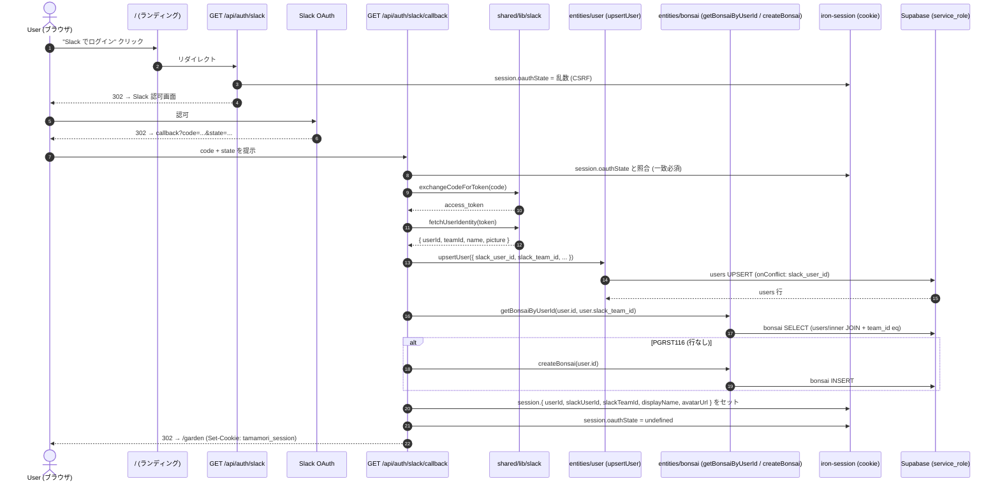
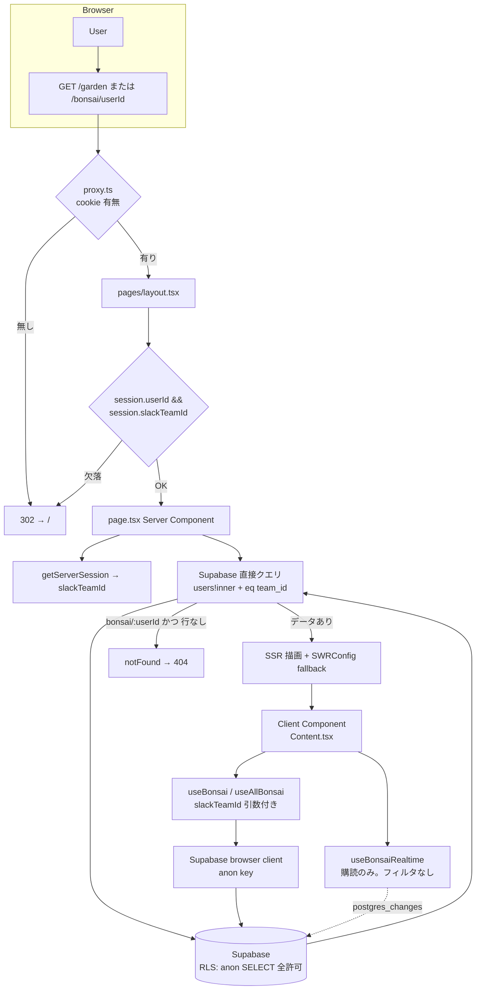
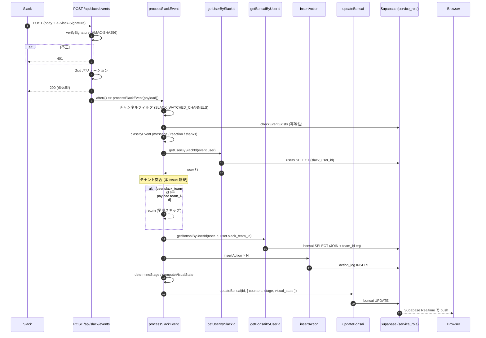
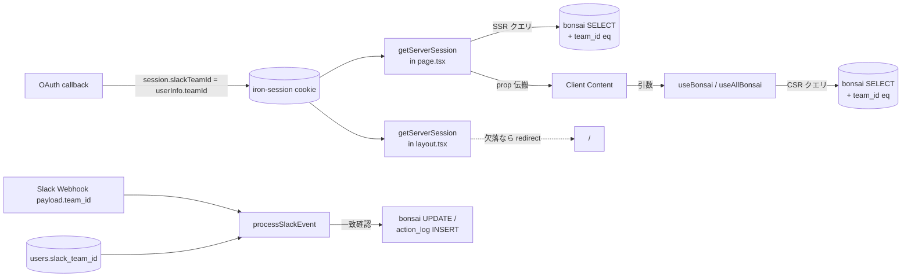

# Issue #74 認証・認可フローマップ

IDOR対策(1/2): アプリ層でのテナント認可 (`slack_team_id`) の**ユーザー操作からDB操作までの全体地図**。

---

## 登場人物

| 層 | ファイル | 役割 |
| --- | --- | --- |
| Edge | `src/proxy.ts` | Cookie の存在チェック（未認証を `/` へ弾く） |
| Layout (Server) | `src/app/(pages)/layout.tsx` | `session.userId` / `session.slackTeamId` の欠落で `/` へ |
| Page (Server) | `src/app/(pages)/garden/page.tsx`, `src/app/(pages)/bonsai/[userId]/page.tsx` | SSR 時のテナント絞り込みクエリ／他テナント userId は `notFound()` |
| Page (Client) | `GardenContent.tsx`, `BonsaiPageContent.tsx` | `slackTeamId` を受けて SWR フックへ伝搬 |
| SWR | `src/entities/bonsai/api/bonsai-swr.ts` | ブラウザ側でもテナント絞り込みクエリを発行 |
| Entity API (Server) | `src/entities/bonsai/api/bonsai-api.ts`, `src/entities/user/api/user-api.ts` | サーバ側 Supabase クエリ（JOIN+フィルタ） |
| Feature (Auth) | `src/features/slack-auth/model/session.ts`, `api/slack-oauth.ts` | セッション定義・OAuth トークン交換 |
| Feature (Growth) | `src/features/bonsai-growth/api/process-event.ts` | Slack イベント処理でのテナント突合 |
| API Route | `src/app/api/auth/slack/callback/route.ts`, `src/app/api/slack/events/route.ts` | OAuth コールバック・Slack Webhook |
| DB | `supabase/migrations/006_enable_rls.sql` | RLS は `anon` に SELECT 全許可（今回は絞り込みはアプリ層で実施） |

---

## 1. ログインフロー（OAuth → セッション確立）



**ポイント**

- セッションに `slackTeamId` を積むのが本 Issue の起点（`session.ts:10`, `callback/route.ts:60`）。以降すべての認可判定はこの値を真実源とする。
- callback 内の bonsai 取得でも新シグネチャ (`getBonsaiByUserId(userId, slackTeamId)`) を使う（`callback/route.ts:48`）。新規登録時は同じテナントなので絞り込んでも結果は変わらないが、呼び出し側の型追従として必要。
- `PGRST116`（行なし）のみを「未作成」として `createBonsai` を呼ぶ分岐は従来通り。

---

## 2. 保護ページのアクセスフロー（SSR + SWR）

### 2-1. 全体像



### 2-2. 防御レイヤーの重ね方

テナント越境アクセスに対して **4層の防御** がある:

1. **Edge proxy** — cookie が無いリクエストをブロック（`proxy.ts:9`）。**ただし** cookie の中身は見ていないので、これは認証の第一層に過ぎない。
2. **Layout guard** — `!session.slackTeamId` で `/` へ。**旧セッション cookie を持つユーザーに再ログインを促す目的**（`layout.tsx:9`）。
3. **SSR クエリのテナントフィルタ** — `users!inner` JOIN と `.eq('users.slack_team_id', slackTeamId)` により、他テナントの行はそもそも取得されない。
4. **`notFound()`** — `/bonsai/[userId]` は存在情報を漏らさず 404 を返す（`bonsai/[userId]/page.tsx:22-24`）。

**Realtime 購読はこの層には入っていない** — 購読スコープは `user_id` フィルタのみで、テナント越境の UPDATE ペイロードは物理的にブラウザに届きうる。ただし届いても `useBonsai` の fetcher が空を返すので UI には反映されない、という設計（`docs/api-design.md` 追記節の「注意」）。抜本対応は #75 RLS。

---

## 3. クエリ構造の変化（本 Issue の核心）

### Before (main)

```ts
// entities/bonsai/api/bonsai-api.ts
await supabase.from('bonsai').select('*').eq('user_id', userId).single();
```

### After (feat/74)

```ts
// entities/bonsai/api/bonsai-api.ts:13-22
await supabase
    .from('bonsai')
    .select('*, users!inner(slack_team_id)')
    .eq('user_id', userId)
    .eq('users.slack_team_id', slackTeamId)
    .single();
```

**読み方:**

- `users!inner(slack_team_id)` — bonsai と users を内部結合。`!inner` により users 側のフィルタが bonsai の結果に反映される（`users` 側にマッチする行が無ければ bonsai 行も返らない）。
- `.eq('users.slack_team_id', slackTeamId)` — 結合先 `users` の `slack_team_id` で絞り込む PostgREST の embedded-filter 構文。
- これにより **「user_id が同じでも、そのユーザーが別テナントに所属しているなら取得不可」** となる。UUID の推測による越境リスクを潰す。

同じパターンが **SSR** (`page.tsx`)・**SWR** (`bonsai-swr.ts`)・**Entity API** (`bonsai-api.ts`) の **3箇所すべてに適用されている**ことを確認するのがレビュー観点。

---

## 4. Slack Webhook フロー（書き込み系）



**ポイント (`process-event.ts:73-76`)**

```ts
// 4.5. テナント突合: payload の team_id と user の slack_team_id が一致しない場合はスキップ
if (user.slack_team_id !== team_id) {
    return;
}
```

- 「同じ `slack_user_id` を別ワークスペースで再登録した／workspace 間で user ID が衝突した」等のケースで、**別テナントの Slack イベントが DB を汚染すること**を防ぐ。
- `user_id` と `team_id` の UNIQUE 制約は現スキーマにないため（`users.slack_user_id` のみ UNIQUE: `001_create_users.sql:4`）、この突合はアプリ層で必ず必要。

---

## 5. テナント ID (`slackTeamId`) の伝搬経路

セッションを起点に、`slackTeamId` が DB クエリに到達するまでの流れを一枚絵にする:



**レビュー時に確認したい一致箇所（全 5 箇所）:**

| # | ファイル | 用途 |
| --- | --- | --- |
| 1 | `src/app/api/auth/slack/callback/route.ts:60` | セッションへの書き込み（Source of Truth） |
| 2 | `src/app/(pages)/layout.tsx:9` | `!session.slackTeamId` ガード |
| 3 | `src/app/(pages)/garden/page.tsx:9,14` / `bonsai/[userId]/page.tsx:12,19` | SSR クエリの絞り込み |
| 4 | `src/entities/bonsai/api/bonsai-swr.ts:19,37` | CSR SWR クエリの絞り込み |
| 5 | `src/features/bonsai-growth/api/process-event.ts:73-76` | 書き込み系の突合 |

---

## 6. 本 Issue のスコープ外（#75 で対応予定）

- **DB 層 RLS の強化** — 現状 `anon` に SELECT 全許可 (`006_enable_rls.sql`)。テナント判定は全部アプリ層。JWT に `slack_team_id` を埋めて RLS 側でも絞る、が #75 のテーマ。
- **Realtime 購読のスコープ** — 上記「防御レイヤー」で触れた通り、購読自体は全テナント横断。fetcher 側で救っている。

この構造ゆえに、**本 Issue の範囲では「アプリ層を経由しない経路（Supabase Realtime 直受信、anon key 直叩き）に脆弱性が残る」** ことを前提に評価する必要がある。
